# Agentic Code Migration with GitHub Copilot

*Version 0.1 - July 2026*

The goal of this workshop is to learn how to use GitHub Copilot to efficiently migrate and modernize large codebases with full agentic capabilities and enterprise-level guardrails to ensure code quality and security.

You can run this workshop using any client of GitHub Copilot but this workshop is specifically designed to serve as a workshop to discover GitHub Copilot App and GitHub Copilot CLI.

<div class="warning" data-title="warning">

> GitHub Copilot, its App and CLI, are a quickly evolving product and thus this workshop may not be 100% up to date with the different features of the various extensions you are going to use. Please be adaptable if it's not exactly the same.

</div>

## Choose your GitHub Copilot path

Select the GitHub Copilot experience you will use for this workshop. Your
choice is stored in the workshop URL, so the following pages only show the
instructions for your selected path.

<div class="info" data-title="Selected path" data-visible="$$copilot_cli$$">

> You selected **GitHub Copilot CLI**. This choice is encoded in the URL as
> `vars=copilot_cli:1`.

</div>

<div class="info app-path" data-title="Selected path" data-visible="$$copilot_app$$">

> You selected the **GitHub Copilot App**. This choice is encoded in the URL as
> `vars=copilot_app:1`.
</div>

<div data-hidden="$$copilot_cli$$">

<button onclick="const url = new window.URL(window.location.href); url.searchParams.set('vars', 'copilot_cli:1'); window.location.href = url"> Use GitHub Copilot CLI </button>

</div>

<div data-hidden="$$copilot_app$$">

<button onclick="const url = new window.URL(window.location.href); url.searchParams.set('vars', 'copilot_app:1'); window.location.href = url"> Use GitHub Copilot App </button>

</div>

## Minimal Pre-requisites

 <div data-visible="$$copilot_cli$$">

You can use **GitHub Copilot CLI** either online in GitHub Codespaces, with no
local installation, or locally on your computer.

</div>

<div data-visible="$$copilot_app$$">

The **GitHub Copilot app** runs locally on your computer and provides a
dedicated graphical experience for agentic development.

</div>

These are the very minimal pre-requisites to run this workshop:

|                                 |                                                                                |
| ------------------------------- | ------------------------------------------------------------------------------ |
| A GitHub account                | [Create free GitHub account](https://github.com/join)                          |
| GitHub Copilot Access activated | Get Access to GitHub Copilot (section below)                                   |
| A web browser                   | [Download Microsoft Edge](https://www.microsoft.com/edge) or any other one ;-) |

## Get Access to GitHub Copilot

There are different ways to get access to GitHub Copilot:

- **As an individual**, you can sign up to use [Copilot Free](https://github.com/github-copilot/signup), without the need for a credit card. You are entitled to a limited number of completions and chat interactions per month with the free plan, which reset each month. Learn more about the [Copilot Free plan details and conditions](https://docs.github.com/en/copilot/about-github-copilot/subscription-plans-for-github-copilot).
- **As an individual**, sign up for a [paid subscription](https://github.com/github-copilot/signup/copilot_individual) to get unlimited completions and chat interactions. You can try GitHub Copilot for free with a one-time 30-day trial.

- **As a member of an organization or enterprise** that has a subscription to GitHub Copilot, you can request access to Copilot by going to [https://github.com/settings/copilot](https://github.com/settings/copilot) and requesting access under "Get Copilot from an organization."

<div class="warning" data-title="warning">

> The **Copilot Free** offer includes only a limited amount of AI Credits that will probably limit your usage. You can still run a majority of this workshop with a free subscription but to finish it completely you will need a paid license.

</div>

## Fork the repository

This workshop uses the following GitHub Repository: *** link to the repo ***

This repository contains a code starter that will help you experiment all capabilities with GitHub Copilot. Take the time to look at the architecture design displayed.

Start by creating **your own fork** of the repository by clicking on the `Fork` button on the top right of the repository page. It will create a copy of the repository in your own GitHub account and you will be free to make any changes you want.


## Set up your selected GitHub Copilot client

<div data-visible="$$copilot_cli$$">

You can run GitHub Copilot CLI in GitHub Codespaces or on your local computer.

**Option 1: Use GitHub Copilot CLI in Codespaces**

The environment is already configured to work with [GitHub Codespaces](https://github.com/features/codespaces), you can find the configuration files in the *.devcontainer* folder.

To start programming just start a new codespace and you are ready to go, don't need to install anything.

<div class="info" data-title="note">

> Every individual users of GitHub has a free plan to run the codespace to let you try it with a free 120 core-hours per month [See Pricing](https://github.com/settings/billing/summary)

</div>


After just a few seconds, you will be redirected to your Codespace environment, a full development environment ready to go in the browser.
**You can start coding right away**, your environment and dependencies are already installed and configured.

Open a terminal in the Codespace and launch GitHub Copilot CLI:

```bash
copilot
```

Your GitHub account and Copilot license are available automatically in the
Codespace.

**Option 2: Use GitHub Copilot CLI locally**

Install [GitHub Copilot CLI](https://docs.github.com/en/copilot/how-tos/copilot-cli/set-up-copilot-cli/install-copilot-cli),
open a terminal in your forked repository, and run:

```bash
copilot
```

Sign in with the GitHub account that has access to Copilot when prompted.

Clone the repo locally. Start from your repon on github.com and select Code => Local => copy url to clipboard
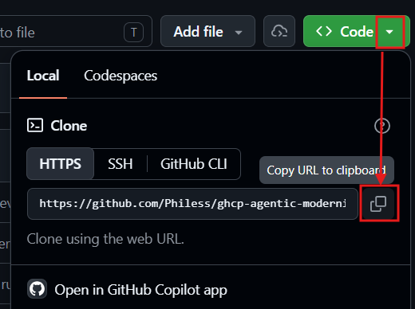

And in target repo, open a new terminal and type:
```bash
git clone *the_repo_path*
cd ghcp-agentic-modernisation-lab
copilot
```

</div>

<div data-visible="$$copilot_app$$">

Install the [GitHub Copilot app](https://github.com/features/ai/github-app),
launch it, and sign in with the GitHub account that has access to Copilot.

Open your forked repository in the app, then create a new chat with
`Ctrl+Shift+O`.

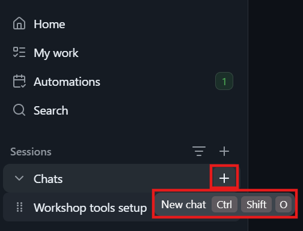

</div>

## Install the project tooling

If you are working locally, install the following tools:

1. JDK 17 or later and Maven 3.6 or later
2. [Node.js and npm](https://docs.npmjs.com/downloading-and-installing-node-js-and-npm)
3. Optionally, Docker and the Azure CLI if you want the assessment to include container and Azure readiness.

The Codespaces environment already includes the required project tooling.

<div class="info" data-title="tip">

> Instead of installing each tool manually, you can ask your selected GitHub
> Copilot client to help you install anything that is missing.

</div>

<div data-visible="$$copilot_cli$$">

Open a GitHub Copilot CLI session and enter this prompt:

</div>

<div data-visible="$$copilot_app$$">

In the GitHub Copilot app, open a new chat with `Ctrl+Shift+O` and enter this
prompt:

</div>

```md
I need some tools to run a workshop. Help me install:
- JDK 17 or later, Maven 3.6 or later
- Node and npm
- Docker and the Azure CLI 
```

<div data-visible="$$copilot_app$$">


</div>

## How to run the code?

Everything is detailed in the bundled
[Order Service README](../app/Java%20-%20Spring%20Boot/Order%20Service/README.md).
From the workshop repository root, first change to the application directory:

```bash
cd "app/Java - Spring Boot/Order Service"
```

Take a look at it, and be sure to run at least the front-end app before going further, it will be mandatory to complete the tutorial.

## Help us improve this Workshop

If you face any challenge or bug running this workshop, please let us know. Your help will be invaluable in making this workshop better, specially as we try to maintain it on a regular basis to keep it up-to-date.

[Report any problem here.](https://github.com/Philess/ghcp-agentic-modernisation-lab/issues/new)

---

# Level 1: Analyze the existing and build a plan

In this level, you will assess the
[Order Service application](../app/Java%20-%20Spring%20Boot/Order%20Service/README.md)
before changing any code. The goal is to establish a trustworthy baseline,
identify modernization risks and opportunities, define a target state, and
produce an actionable plan.

<div class="info" data-title="Selected path" data-visible="$$copilot_cli$$">

> You are on the **GitHub Copilot CLI** path. 

</div>

<div class="info app-path" data-title="Selected path" data-visible="$$copilot_app$$">

> You are on the **GitHub Copilot App** path. 

</div>

<div data-hidden="$$copilot_cli$$">

<button onclick="const url = new window.URL(window.location.href); url.searchParams.set('vars', 'copilot_cli:1'); window.location.href = url"> Use GitHub Copilot CLI </button>

</div>

<div data-hidden="$$copilot_app$$">

<button onclick="const url = new window.URL(window.location.href); url.searchParams.set('vars', 'copilot_app:1'); window.location.href = url"> Use GitHub Copilot App </button>

</div>

## Before you begin

Make sure you completed all the required pre-requisites and installed the required tools. You should have a working environment with your selected GitHub Copilot client. You should also have forked the repository and have access to the code.

Do not start upgrading dependencies or editing application code yet. Level 1
is complete when the findings and plan have been reviewed.

## Step 1: Discover Awesome Copilot and install the plugin

[Awesome Copilot](https://github.com/github/awesome-copilot) is a
community-created collection of customizations that extend GitHub Copilot. Open
the repository, then use the [Awesome Copilot catalog](https://awesome-copilot.github.com/)
to explore its contents.

Identify the purpose of each customization type before continuing:

| Customization | Purpose |
| --- | --- |
| Agents | Specialized Copilot personas and tool configurations for a particular role or workflow. |
| Instructions | Coding standards and project guidance applied automatically to matching files. |
| Skills | Reusable domain knowledge, procedures, and supporting resources that Copilot can load when relevant. |
| Plugins | Installable bundles of agents, skills, commands, hooks, or extensions for a complete workflow. |

Open **Plugins** in the catalog and search for
[github-copilot-modernization](https://awesome-copilot.github.com/plugin/github-copilot-modernization/).
This Microsoft-maintained plugin provides autonomous modernization for Java and
.NET applications through a hierarchy of orchestrator, coordinator, and
executor agents. Before installing it, open its [details](https://github.com/microsoft/github-copilot-modernization/tree/main/plugins/github-copilot-modernization)  and answer the following
questions:

1. Which modernization scenarios and application languages does it support?
2. Which agent can a user invoke directly?
3. Where does it write assessment and planning artifacts?
4. How can an enterprise rulebook constrain its recommendations?

Install the plugin using your selected GitHub Copilot client.

<div data-visible="$$copilot_app$$">

**Install from the GitHub Copilot app**

On the plugin details page, select **Open in GitHub Copilot app** and confirm the installation when prompted.
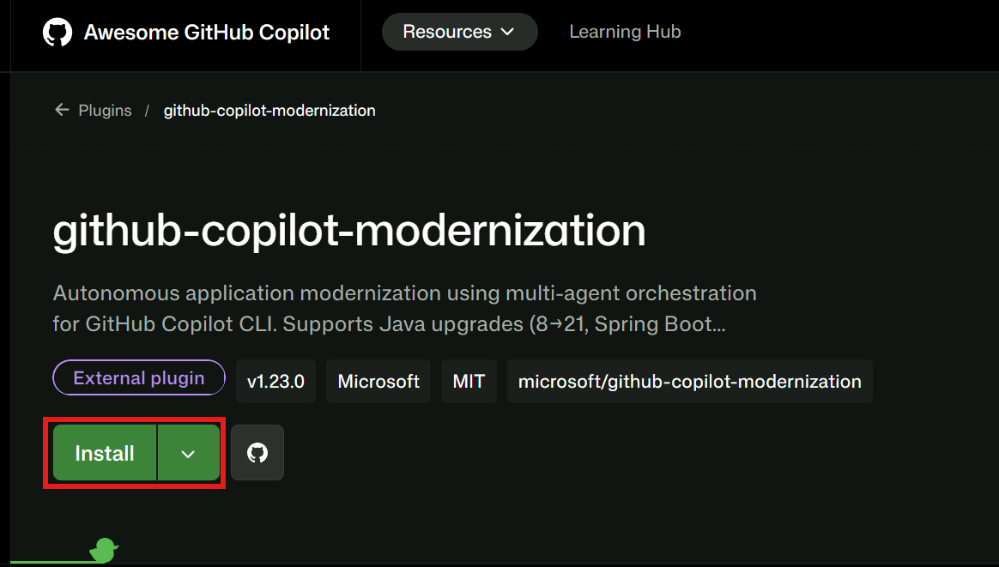


The plugin is installed under the **awesome-copilot** marketplace. Expand the
marketplace to view all available plugins and activate or deactivate them as
needed.


You can also view the installed plugin's skills by opening the **Skills** tab in the app, and filter by plugin.


</div>

<div data-visible="$$copilot_cli$$">

**Install with GitHub Copilot CLI**

Following the plugin repository's installation instructions, you should start by adding the marketplace to your CLI like this:

```bash
/plugin marketplace add github/awesome-copilot
```

But if you try it for Awesome Copilot you should get a message that it's alread instaled by default. Just keep it in mind for other marketplaces in the future. A marketplace is a repo with a specific registry to distribute plugins, skills, and other useful resources. You can easily create your own or add other from various providers.

As the marketplace is already installed we can install our mordernization plugin immediately:

```bash
/plugin install github-copilot-modernization@awesome-copilot
```
Verify that the marketplace and plugin are available:

```bash
/plugin marketplace list
/plugin list
```

You can view installed plugin skills, MCP servers, and agent commands with:

```bash
/env
```


</div>

## Step 2: Establish the current baseline

Before asking GitHub Copilot to assess the project, confirm that the existing
application can be built and tested in its current state. From the Order
Service project directory

<div data-visible="$$copilot_app$$">

In the GitHub Copilot app, start a new session in your forked lab repository.


> Create a new session for the baseline checks. Keeping this work in a separate
> session makes the original build and runtime evidence easier to review later.

Enter `!` alone on an empty prompt to enter shell mode.

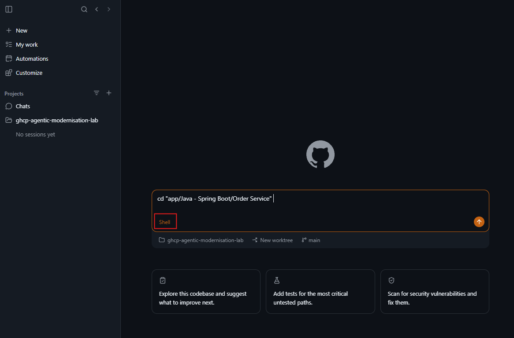
> Shell mode runs commands directly in the repository environment. Change to
> the Order Service directory, then run `mvn clean test` and `mvn clean package`.
> Record any failure.

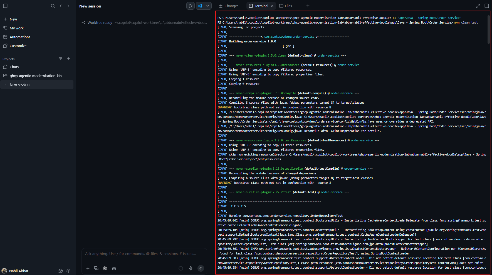
> After the tests and package build complete, run `mvn spring-boot:run` to start
> the backend. Leave this terminal running for the API and frontend checks.
> Open the built-in interactive browser canvas to view the API response.

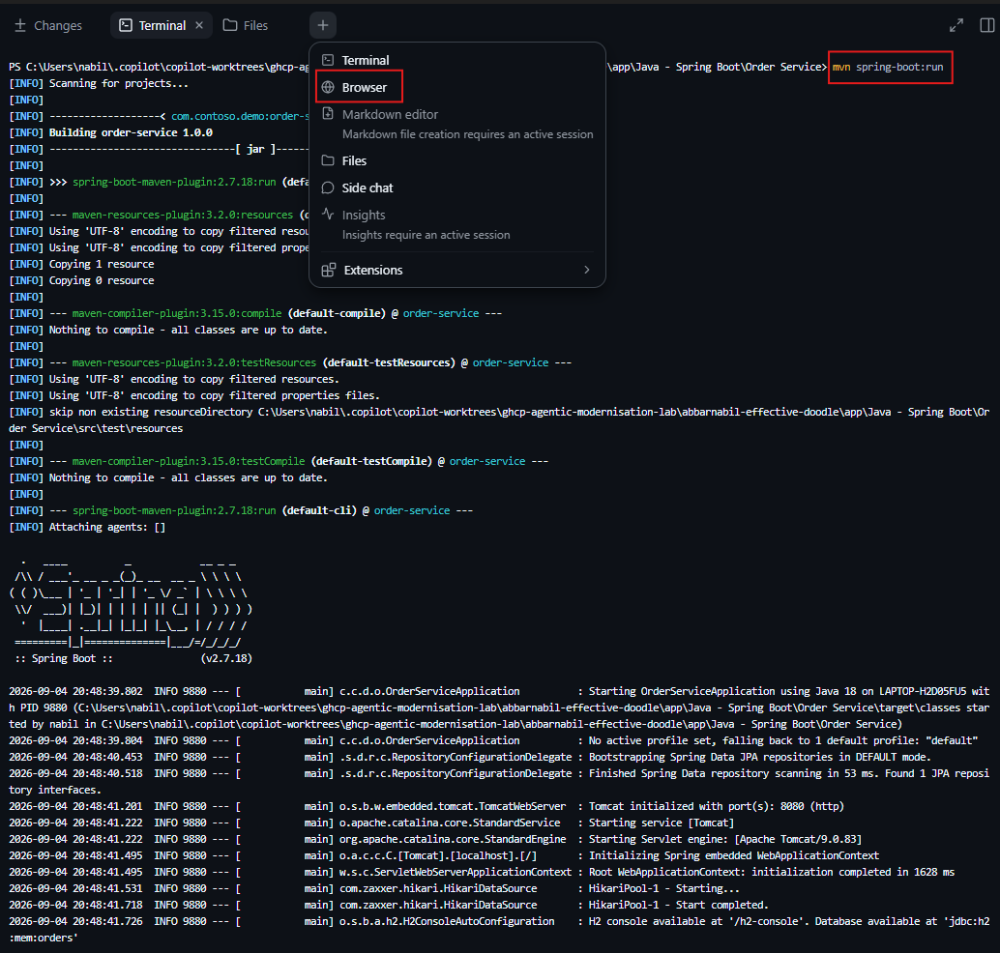
> Confirm that Spring Boot starts without errors and note any warnings. Open
> `http://localhost:8080/api/orders` to verify that the seeded API responds.

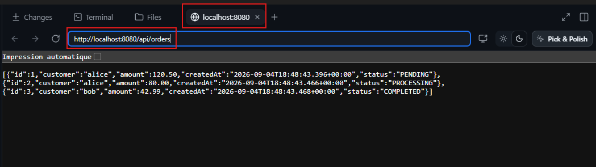
> The browser response establishes the baseline API contract.

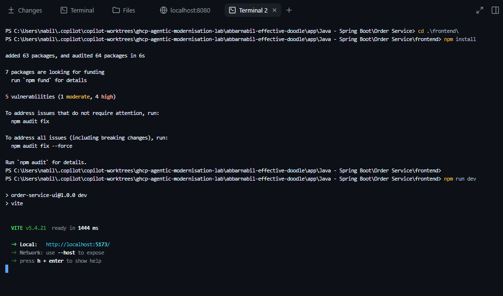
> Open another terminal, change to the `frontend` directory, and run
> `npm install` followed by `npm run dev`. Keep the backend running.

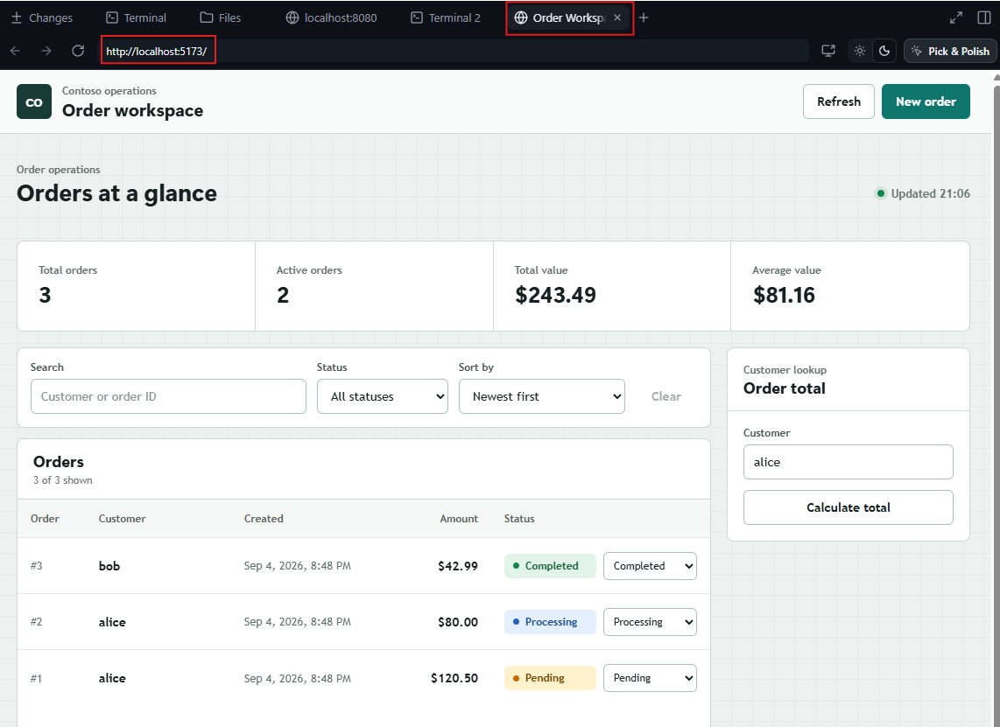
> Open `http://localhost:5173` (or click on the link in the terminal in codespace) and confirm that the order list loads from the
> backend. Also exercise the create-order workflow and record any browser or
> terminal errors as baseline evidence.

</div>

<div data-visible="$$copilot_cli$$">

Open another terminal in the repo folder and type:

```bash
cd "app/Java - Spring Boot/Order Service"
```

```bash
mvn clean test
mvn clean package
```

Record any failure instead of fixing it. A pre-existing failure is part of the
baseline and must not later be attributed to the modernization.

Start the backend in a terminal:

```bash
mvn spring-boot:run
```

Confirm that the seeded Order API responds at
`http://localhost:8080/api/orders`:

```bash
curl http://localhost:8080/api/orders
```

In a second terminal, install and start the frontend:

```bash
cd frontend
npm install
npm run dev
```

Open `http://localhost:5173` and confirm that the UI can retrieve orders from
the backend. Record the test results, API response, and any startup warnings as
part of the baseline.


<div class="info" data-title="tip">

> Instead of launching all these commands manually you can also simply ask to copilot to <b>"Build and launch my App. Install dependencies and start my backend and my frontend"</b> and it will do the same for you. Sometimes it's just important to do things manually to better understand what's your dealing with but copilot is also a very powerfull tool to discovers new codebase.

</div>

</div>

Inspect the repository and capture:

- modules and their responsibilities;
- current Java version, build tool, and Spring Boot versions;


## Step 3: Check modernization readiness

The plugin discovers Java projects from a `pom.xml` file. From
the Order Service project directory, confirm that the build file is present and
check the required tools:

```bash
java -version
mvn -version
node --version
npm --version
git --version
```

Resolve only missing tooling that prevents assessment. Record optional tooling
that will be needed in later levels.

## Step 4: Run the assessment

<div data-visible="$$copilot_app$$">

Start by selecting the "Auto" model to let copilot choose the most token and performance optimized model for the coming task.

In the Session, select the `modernize-java-assessment` agent.


</div>

<div data-visible="$$copilot_cli$$">

From the root of your forked lab repository, start GitHub Copilot CLI:

```bash
copilot
```

Enter `/model` and enter, and then select the "Auto" model to let copilot choose the most token and performance optimized model.

Enter `/agent` and select the `modernize-java-assessment` from the agent picker.
The plugin declares this assessment agent as user-invocable and configures its
preferred model.

</div>

Send the following prompt to the agent:

```text
Assess this Java application Order Service for migration to Java 25, upgrading Spring Boot, and remediating security vulnerabilities.
```

<div data-visible="$$copilot_app$$">

GitHub Copilot creates a Git worktree for the session. 
A worktree is an additional checkout linked to the same Git repository: it shares the
repository's history and objects while maintaining its own working directory,
index, and checked-out branch. This gives Copilot an isolated workspace in
which to analyze the application without changing the files in your main
working directory, and it allows multiple agent sessions to work in parallel.

The assessment agent delegates the detailed analysis to a specialized subagent,
which starts as a background task. The **Background** indicator shows that the
subagent is still running and can be opened to monitor its progress. Wait for
the background task to finish and return its evidence-based findings before
reviewing the generated assessment report.


</div>

<div data-visible="$$copilot_cli$$">

The assessment agent can delegate detailed analysis to background subagents.
Enter `/tasks` to inspect active work and wait for every assessment task to
finish. When the agent returns its final summary, confirm the generated report
path and open the Markdown report in your editor.

You will be prompted to allow Copilot to run some commands along the way. 

</div>

Assessment agent first identifies the application structure and technology stack. It locates the relevant source directories, build files, dependency manifests, tests, configuration, deployment files, and existing modernization artifacts.

After the assessment is complete, the agent generates **a report in Markdown** that includes a summary of the findings and recommendations.

<div data-visible="$$copilot_cli$$">

On the bottom of the terminal, you can see which model has been selected by Copilot and what is the current consumption of AI credits for the current session:
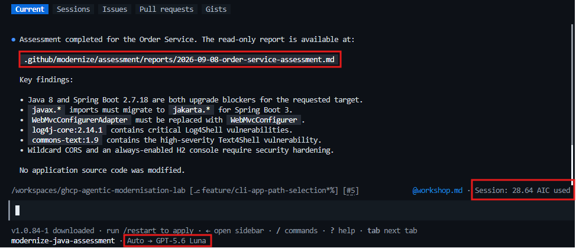

The assessment report describes the current state of the application, including its dependencies, vulnerabilities, and modernization opportunities.

You can **ctrl+click** on the report path to open it.

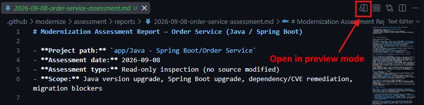

Take time to review the content.
</div>


> The opening inventory compares the current Java 8 and Spring Boot 2.7 stack with the Java 25 and Spring Boot 3.5 targets. It also surfaces end-of-life components and vulnerable dependencies that require attention.


> The compatibility analysis identifies the concrete changes required for the upgrade.


> The security findings trace each CVE to a specific dependency and version, explain its impact, and provide a minimum safe upgrade target. The agent queries **[GitHub’s public advisories](https://github.com/advisories)**, in batches of dependencies, using package/version.


> The recommended sequence isolates risk into testable stages: remediate CVEs first, move to Java 17, complete the Spring Boot and Jakarta migration, and then advance to Java 25. Running the full test suite after each stage makes failures easier to identify and resolve.


## Step 5: Validate and refine the findings

Compare each material finding in the assessment with the baseline evidence.
Correct unsupported assumptions, add missed dependencies and constraints, and
record which recommendations you accept, reject, or defer before planning.

## Step 6: Build the modernization plan

Now that the assessment is complete and validated, you can generate a modernization plan. The plan organizes the recommended tasks into a prioritized sequence of executable steps, including validation criteria for each task.

It's time to start fresh with a new Copilot session !

### Why start a new session?

The first session has completed its assessment role and externalized the information needed for planning into a repository artifact:

- `./assessment/assessment.md` contains the validated findings, supporting evidence, risks, and recommendations;

This file provides a durable handoff between the assessment and planning phases, so the planning agent does not need the assessment conversation itself. That conversation may contain source-code scans, command output, subagent messages, intermediate conclusions, and repeated findings. Continuing in the same session makes that history compete with the plan for space in the model's context window and can cause Copilot to process more tokens on every turn.

Starting a new session gives the planner a clean context. Copilot only needs to load the final assessment artifacts, the planning prompt, and any relevant project files. This reduces unnecessary token usage, leaves more context capacity for producing a detailed plan, and prevents superseded assessment discussions from distracting the planner from the validated findings.

> **Important:** Before requesting the handoff, make sure `assessment.md` is saved and available on the branch or worktree that the new session will use. The files carry the work forward; the previous chat history does not.

<div data-visible="$$copilot_app$$">

You do not need to create the session or change its mode manually. From the completed assessment session, copy and send the following prompt:

<div class="info" data-title="tip">

> By typing @, you will have a filepicker to help you provide the exact path

</div>

```text
First persist and commit the completed assessment artifact at @{{assessment_file_path}} so it is available to and can be read by the planning session. After that, create a new session for this repository in Plan mode, using Auto mode for model selection. In the new session, use assessment.md as the source of truth to create a prioritized, executable modernization plan for the Order Service. Preserve the validated target state and accepted recommendations recorded in this artifact. Include dependencies, risk, scope, and validation criteria for every task. Keep this assessment session unchanged and perform all planning in the new session.
```

> **Note:** The prompt requests **Auto** mode for model selection, but you can instead select a reasoning model for planning the modernization.


> Copilot confirms that it created a separate planning session grounded in the assessment artifact. The assessment session remains unchanged and only coordinates the handoff.


> The new session appears separately in the repository session list. It runs in **Plan** mode with the planning coordinator agent, loads the modernization-planning skill from the plugin, and references `assessment.md` in the kickoff prompt.


> Copilot first presents a concise plan summary for review. It preserves the validated security-first sequence, orders the migration tasks by dependency, identifies the files it will generate, and waits for approval.


> Select **View full plan** to inspect the complete proposal. Verify the problem statement, target Java and Spring Boot versions, task priorities, exact scope, and task ordering against the validated assessment.


> The final sections define release gates between the security, Spring Boot, Java 21, and Java 25 stages. They also identify the persistent `plan.md` and `tasks.json` outputs and confirm that the assessment artifacts remain read-only.


> The completed plan pauses at an explicit approval gate. Review the full plan before selecting **Approve and implement with autopilot**; alternatively, exit Plan mode to continue manually or request changes when the scope, sequencing, or validation criteria need refinement.


> After approval, Copilot persists the executable task graph in `tasks.json`. Each task records its type, exact requirements, dependencies, and measurable success criteria, enabling the implementation agents to execute work in the intended order and verify every result.


> After approval, Copilot validates and saves the two planning artifacts, `plan.md` and `tasks.json`, in the repository's `.github/modernize/` directory. No modernization tasks are executed at this stage.

</div>

<div data-visible="$$copilot_cli$$">

In the completed assessment Copilot CLI session, first confirm that the `assessment.md` file is
saved. Then enter `/new` to start a clean conversation, enter `/agent`, and
select the user-invocable `modernize` orchestrator. The orchestrator delegates
planning to the plugin's internal planning coordinator.

Press `Shift+Tab` until the status line shows **Plan** mode (in blue), then enter:

```text
Use @{{assesment_file_path}} as the source of truth to create a prioritized, executable modernization plan for the Order Service. Preserve the validated target state and accepted recommendations recorded in this artifact. Include dependencies, risk, scope, and validation criteria for every task. Do not implement the plan.
```

<div class="info" data-title="tip">

> By typing @ in Copilot CLI, you will have a filepicker to help you provide the exact path

</div>

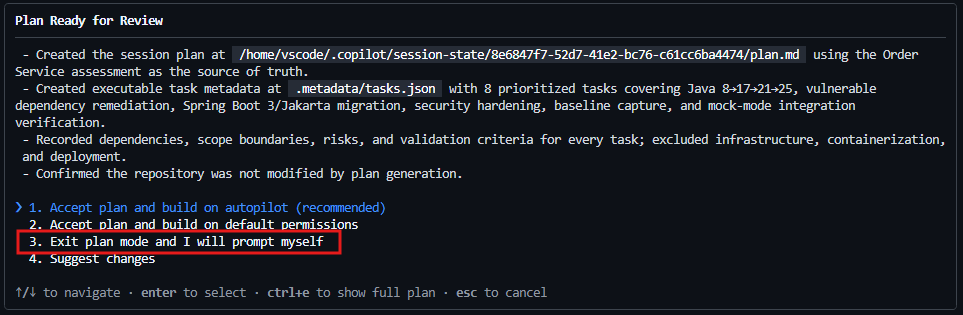

When the task is finished, a plan and a task list has been created. Select `Exit plan and I will prompt it myself`.

To read the plan in detail you can type `/session plan` whenever you
want to reopen it, and request revisions until the scope, ordering, dependencies,
and validation gates match the assessment.

To open it in edit mode and make manual changes just do `ctrl+y` and you'll be able to apply some changes.

</div>

When the plan is ready, enter:

```text
Persist the approved modernization plan as plan.md and tasks.json under .github/modernize/. Validate both artifacts and stop without executing any modernization task.
```

<div data-visible="$$copilot_cli$$">

Confirm that both files were written and that no application source files were
changed. On codespace, if you don't  see the files in the file explorer, hit the refresh button and you should see them.
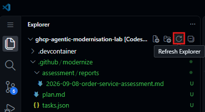 

</div>

---

# Level 2: Setup the guardrails

<div class="info" data-title="Selected path" data-visible="$$copilot_cli$$">

> You are on the **GitHub Copilot CLI** path. 

</div>

<div class="info app-path" data-title="Selected path" data-visible="$$copilot_app$$">

> You are on the **GitHub Copilot App** path. 

</div>

<div data-hidden="$$copilot_cli$$">

<button onclick="const url = new window.URL(window.location.href); url.searchParams.set('vars', 'copilot_cli:1'); window.location.href = url"> Use GitHub Copilot CLI </button>

</div>

<div data-hidden="$$copilot_app$$">

<button onclick="const url = new window.URL(window.location.href); url.searchParams.set('vars', 'copilot_app:1'); window.location.href = url"> Use GitHub Copilot App </button>

</div>

Before running the implementation with the created plan, it's always better to define your coding and quality standard, the methodologies, patterns and practices that will guide the modernization process.

We call these the **guardrails** and it's the best way to ensure that the results of the modernization process align with your standards and expectations.

Exactly as you onboard new team members, you should define and communicate the guardrails to ensure everyone follows the same standards and practices during the modernization process.

## Agents, Skills & Instructions

GitHub Copilot can use custom agents Agents, Skills and Instructions to perform specific tasks with better accuracy.

Agents let you give it a specific persona with built-in standards, like a code reviewer that enforces type hints and PEP 8, or a testing helper that writes pytest cases. You’ll see how the same prompt gets noticeably better results when handled by an agent with targeted instructions.

Skills encapsulate reusable logic, while instructions guide the agents on how to use these skills effectively. 

Instructions files contain the guidance that is automatically followed by the agents and we will use it to define specific context and rules about our project.

## Step 1: Find and install plugins, skills, agents and instructions

Awesome Copilot provide a bunch of very useful resources built by the community that will help you accelerate your guardrails initial setup.

Before running the following command, make sure you have started a new Copilot session.

<div data-visible="$$copilot_cli$$">

<div class="info" data-title="tip">

> If you stopped a previous session but you want to reopen it, you can use the <b>/resume</b> command.

</div>

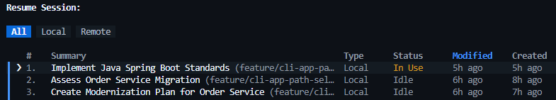


**In the new Copilot session**, run the following command to browse the Awesome Copilot marketplace:

```bash
/plugin marketplace browse awesome-copilot
```

This will list all the available plugin with a short description. To optimize your experience install the "awesome-copilot" plugin:

```bash
/plugin install awesome-copilot@awesome-copilot
```

This install 3 dedicated skills that will suggest the most relevant and context-aware specialized Instructions, Agents or Skills from Awesome Copilot based on your prompt.

```bash
/awesome-copilot:suggest-awesome-github-copilot-instructions <your-prompt>
/awesome-copilot:suggest-awesome-github-copilot-agents <your-prompt>
/awesome-copilot:suggest-awesome-github-copilot-skills <your-prompt>
```

Try this prompt to find relevant instructions files for Java development:

```bash
/awesome-copilot:suggest-awesome-github-copilot-instructions java and springboot coding standards
```

This will provide you something like this:
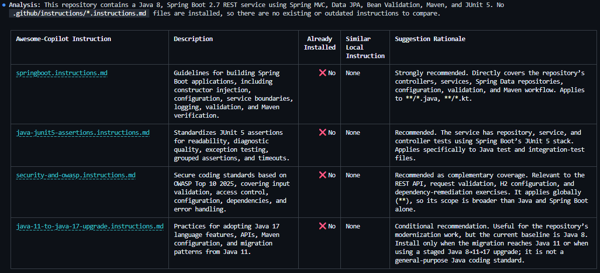

If you want to install one of the suggested instructions files, run the following command:

```bash
install the springboot.instructions.md file
```

## Step 2: Prepare your project for AI

We want to optimize out project for AI development, ensuring that all necessary instructions files are installed and the project structure aligns with the guidelines provided by the Awesome Copilot skills.

There is plenty of Skills available that can help achieve that. Here are a few step to follow to help you kickstart it effectively. It's just one way to get started, and we recommend that you explore more skills to build your own optimized AI development workflow.

**Prepare your project for AI**

We will start by installing a first skill, named `AI-Ready` created by John Papa.

This can be install through a dedicated plugin available in the Awesome Copilot marketplace.

```bash
/plugin install ai-ready@awesome-copilot
```

Then simply launch the process by typing the following command:

```bash
make this repo ai ready to prepare for code modernization according to @.github/modernize.plan.md
```

The skill will run a complete analysis of your project, the plan and will try to optimize your project structure and configuration for AI development.

It will automatically create a main instructions file to add precise contexte for Copilot such as the important files for migrations, the code structure, code conventions and rules. It can also create or install some other specific instructions files, prompts and skills as needed.

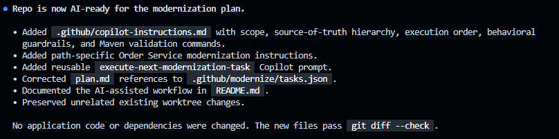

</div>

## Step 3: Use copilot to install all necessary skills

We have a clear technology stack and project structure defined with our migration plan and we can use it to guide the installation of all necessary skills for our project.

In order to improve the speed and efficiency of finding and installing the necessary skills, we will use the `fleet` command with `autopilot` mode to leverage multiple agents in parallel.

Open a new Copilot, ensure you are in `auto` model (or your choice of model), press `shift+tab` until you go in `autopilot` mode and start by typing this prompt:

```bash
/fleet According to @.github/modernize/plan.md and help me find and install the most relevant skills to help migrate my project according to the best practices. First use the suggest-awesome-github-copilot-skills skill to analyse and find the best one. Let me choose and help me install it on my project.
```

**Autopilot mode** will launch multiple agents in parallel and you will be able to monitor it with the `/tasks` command during the process.

Once the process is complete, you can simply choose the skills you want to install and let Copilot handle the installation for you.
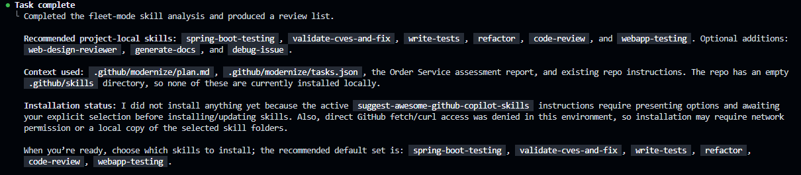

Guardrails are essential to improve the quality and reliability with AI-driven development processes but keep in mind that **every instructions file and skills you add** will be integrated into the context sent with your Copilot requests, **consuming tokens**. Keep it clean and concise and don't overload it with unnecessary information.

<div class="info" data-title="Tip">

> Some skills can help reduce you tokens consumption by installing the `caveman` instructions files or the `steno` skill from Awesome Copilot.

</div>


---

# Level 3: Implementation

<div class="info" data-title="Selected path" data-visible="$$copilot_cli$$">

> You are on the **GitHub Copilot CLI** path. 

</div>

<div class="info app-path" data-title="Selected path" data-visible="$$copilot_app$$">

> You are on the **GitHub Copilot App** path. 

</div>

<div data-hidden="$$copilot_cli$$">

<button onclick="const url = new window.URL(window.location.href); url.searchParams.set('vars', 'copilot_cli:1'); window.location.href = url"> Use GitHub Copilot CLI </button>

</div>

<div data-hidden="$$copilot_app$$">

<button onclick="const url = new window.URL(window.location.href); url.searchParams.set('vars', 'copilot_app:1'); window.location.href = url"> Use GitHub Copilot App </button>

</div>

You are now ready to execute the approved modernization plan with your selected GitHub Copilot client. Both paths invoke the same `modernize` orchestrator and use the plan artifacts created in Level 1 and refined with the guardrails from Level 2.

The implementation is intentionally performed in a separate session. The execution agents need the final `plan.md`, `tasks.json`, rulebook, and project files, but they do not need the assessment and planning conversations.

## Before you begin

Confirm that:

- the final `plan.md` and `tasks.json` are present under
  `.github/modernize/<plan-name>/`;
- the plan reflects the guardrails added in Level 2;
- the approved artifacts are available in the branch or worktree used by the
  new execution session;
- the baseline tests from Level 1 pass, or any pre-existing failures have been
  recorded; and
- the target JDK and Maven versions required by the approved plan are
  available.

Do not run two implementation sessions against the same worktree at the same
time. The executor creates a dedicated `modernize/java-<timestamp>` branch and
all worker agents contribute to that branch.

## Understand the multi-agent workflow

Only the `modernize` agent is user-invocable. Do not select an execution
coordinator or worker directly. The orchestrator loads the existing plan and
delegates its tasks through the following hierarchy:


The execution coordinator groups related Java and Spring Boot upgrades into a single delegation, sends security and migration work to their specialized agents, runs independent work in parallel when possible, and waits for task dependencies before continuing. Each worker is responsible for its code changes, commits, and validation.

## Step 1: Choose the execution model

Model choice affects reasoning quality, tool use, speed, and AI credits consumption. The plugin's agents declare their own [preferred models](https://github.com/microsoft/github-copilot-modernization/blob/8b644bebc7e1f929c01d80788293a37872f480f8/plugins/github-copilot-modernization/agents/execution-coordinator.agent.md?plain=1#L4).

If the configured model is unavailable in your organization, choose an available model optimized for complex coding and agentic tool use.

Record the selected model so you can compare execution time, tool calls, and results with another model after the workshop.

<div data-visible="$$copilot_app$$">

Use the model picker in the GitHub Copilot app to select the model for the new
implementation session.

</div>

<div data-visible="$$copilot_cli$$">

Enter `/model` in GitHub Copilot CLI and select the model for the implementation
session.

</div>

## Step 2: Start the implementation

<div data-visible="$$copilot_app$$">

Remain in the completed planning session after approving the plan. From that same session, send the following handoff prompt:

```text
Start a new session with the modernize agent in Autopilot mode using Claude sonnet 4.6. In that new session, execute the approved modernization plan for the Order Service from @plan.md. Use @tasks.json as the source of truth, enforce the rulebook, and respect every dependency and validation gate.
```


Copilot creates a separate implementation session and worktree while leaving the approved planning session unchanged. Open the new session from the repository session list, then verify that it uses the `modernize` agent, runs in **Autopilot** mode, and references the approved `plan.md` and `tasks.json` before implementation begins.


</div>

<div data-visible="$$copilot_cli$$">

From the completed planning conversation, confirm that the approved `plan.md`
and `tasks.json` are available, then enter `/new`. Enter `/agent` and select the
user-invocable `modernize` orchestrator. Enter `/model` and select Claude Sonnet
4.6, or the closest model available in your organization.

Press `Shift+Tab` until the status line shows **Autopilot** mode. Review the
permission prompt carefully; grant the permissions required by the plan only in
the isolated workshop repository or Codespace.

Enter this prompt:

```text
Execute the approved modernization plan for the Order Service from @plan.md. Use @tasks.json as the source of truth, enforce the rulebook, and respect every dependency and validation gate.
```

Let the orchestration finish before editing files in the implementation worktree.

</div>

<div data-visible="$$copilot_app$$">

The session delegates implementation tasks to background subagents. Open the **Background** view to inspect which specialized agent owns each task and to follow its progress.


</div>

<div data-visible="$$copilot_cli$$">

The session delegates implementation tasks to background subagents. Enter
`/tasks` to inspect ownership and progress. Select a task to view its details or
open the delegated agent's session, then return to the main session and allow
the orchestration to finish.

</div>

## Step 3: Observe the orchestration

While execution is running, identify and record:

1. the branch created for the implementation;
2. the task groups sent to each specialized worker;
3. the build or test command used at each release gate; and
4. any retry, blocked task, or deviation from the approved plan.

<div data-visible="$$copilot_app$$">


</div>

<div data-visible="$$copilot_cli$$">

Use `/tasks` to follow active and completed subagents. You can also inspect the
implementation branch and recent commits without leaving the CLI by entering:

```text
!git branch --show-current
!git log --oneline --decorate -10
```

</div>

Autopilot removes repetitive approval prompts; it does not remove quality gates. A task is successful only when its required build, tests, and acceptance criteria pass. If a worker reports a failure, preserve its diagnostics and do not approve the remaining dependent tasks as complete. Ask the orchestrator to retry only after you have reviewed the cause.

## Step 4: Review the execution result

When all workers return, inspect the final execution summary. It should state:

- completed and failed tasks;
- files and dependencies changed;
- commits created on the modernization branch;
- build and test results; and
- any manual follow-up work.

<div data-visible="$$copilot_app$$">


</div>

<div data-visible="$$copilot_cli$$">

Enter `/tasks` and confirm that no implementation task is still active. Then
enter `/diff` to review the modernization branch changes from inside GitHub
Copilot CLI.

</div>

Review the branch history and working tree before running your own checks

## Step 5: Verify independently

Agent-reported validation is useful evidence, but it does not replace your own
acceptance check. From the Order Service directory, run:

```bash
mvn clean test
mvn clean package
```

Confirm the effective runtime and build JDK match the approved target:

```bash
java -version
mvn -version
```

Start the modernized backend:

```bash
mvn spring-boot:run
```

In another terminal, verify that the existing API contract still works:

```bash
curl http://localhost:8080/api/orders
```

Finally, start the frontend and confirm that its order list and create-order
workflow still work against the modernized API:

```bash
cd frontend
npm install
npm run dev
```

Compare these results with the Level 1 baseline. Record any behavior change,
warning, failed test, or plan deviation before moving to the quality and
security review in Level 4.

---

# Level 4: Quality & Security

In this level, use **[Copilot Coding Review](https://docs.github.com/en/enterprise-cloud@latest/copilot/how-tos/use-copilot-agents/request-a-code-review/use-code-review)** to review the pull request created
in the previous levels. You will add a [custom review instruction](https://docs.github.com/en/enterprise-cloud@latest/copilot/how-tos/use-copilot-agents/request-a-code-review/use-code-review#customizing-copilots-reviews-with-custom-instructions), run the review,
and capture the results.

In Copilot Chat, run `/awesome-copilot:suggest-awesome-github-copilot-instructions` to find or generate Copilot instruction files that are suitable for code reviews. Use the suggested review instructions to inform the custom instruction for this pull request.

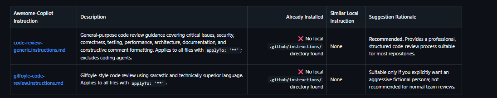

## Use Copilot Coding Review with custom instructions

Install the practical generic one: code-review-generic.instructions.md as `.github/copilot-instructions.md`

Commit and push the addition to the already-open PR branch

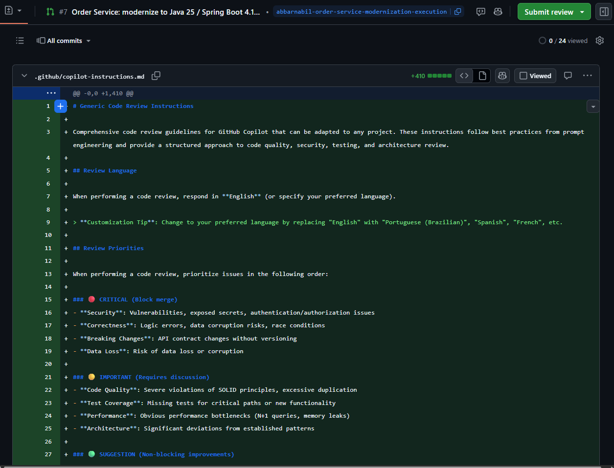

Under "Reviewers" in the right sidebar, next to Copilot, click Request.

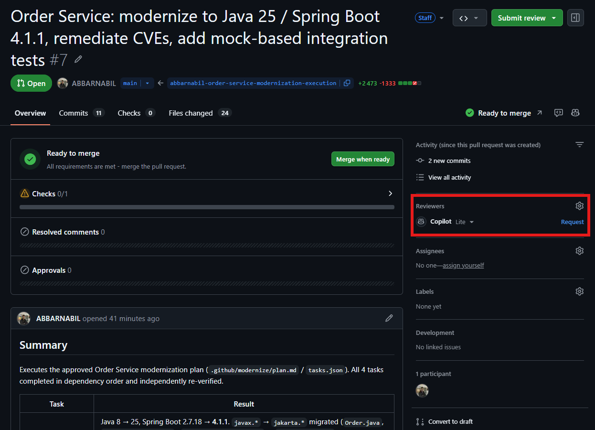

Wait for Copilot to review the pull request and provide its feedback.
Scroll down and read through Copilot's comments.

Review each comment and decide whether to apply, discuss, or dismiss it. Copilot labels each comment with a severity level of "High," "Medium," or "Low" to help you prioritize the issues it finds based on their importance.


---

# Bonus: Generate a migration report


<div class="info" data-title="Selected path" data-visible="$$copilot_cli$$">

> You are on the **GitHub Copilot CLI** path. 

</div>

<div class="info app-path" data-title="Selected path" data-visible="$$copilot_app$$">

> You are on the **GitHub Copilot App** path. 

</div>

<div data-hidden="$$copilot_cli$$">

<button onclick="const url = new window.URL(window.location.href); url.searchParams.set('vars', 'copilot_cli:1'); window.location.href = url"> Use GitHub Copilot CLI </button>

</div>

<div data-hidden="$$copilot_app$$">

<button onclick="const url = new window.URL(window.location.href); url.searchParams.set('vars', 'copilot_app:1'); window.location.href = url"> Use GitHub Copilot App </button>

</div>

You reached the end of this migration, congratulations!

The last step of your job is to be able to present your work to your team or stakeholders and putting a value on the improvements and changes you have made.

GitHub Copilot maintain a local history of your sessions and it's very easy for you to request a summary or generate a presentation based on your work history.

Open a new Copilot session and select a medium model like `GPT-5.6 Luna` for example and type the following prompt:

```bash
Generate a markdown report listing all operations done in all copilot session on this folder for the past 24 hours, detailing which model has been used and how many AI Credit where consumed and many other details
```

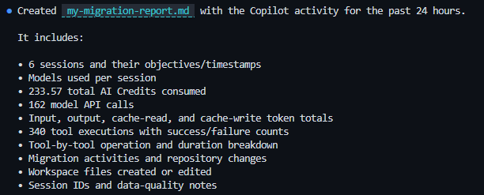

Open the report file in preview mode to review the generated content.

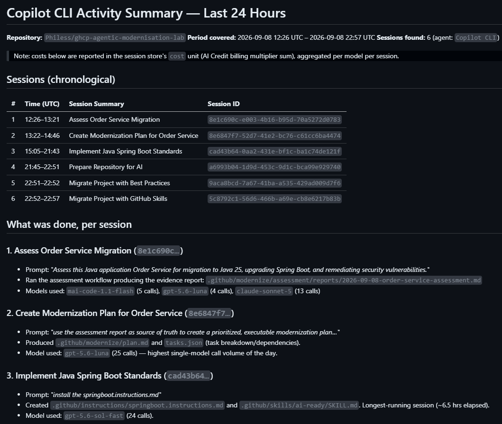

This is pretty cool but what if you have a last minute opportunity to present your work and you need a shiny Business oriented PPT presenting your migration and improvements and also the AI cost incurred?

Let's see how GitHub Copilot can help you handle that!

First, you will need to add the `anthropic/skills` marketplace and install the `document` plugin:

```bash
/plugin marketplace add anthropics/skills
/plugin install document-skills@anthropic-agent-skills
```

This plugin add capabilities to generate documents such as Excel, Word, PowerPoint, and PDF.

Now switch to `autopilot` mode and ask to copilot to generate the PPT for you:

```bash
Using the files in @.github/modernize and the sessions report, create a 4 slides PowerPoint presentation including the highlight of this migration, with all the technical and business impacts, add details on how we ensure quality and finish with a dashboard style final slide focused on the AI usage and cost for this migration. Use Playwright for adding screen capture. Make it modern and visually appealing.
```

Once finished open and review the document and you are ready to go!

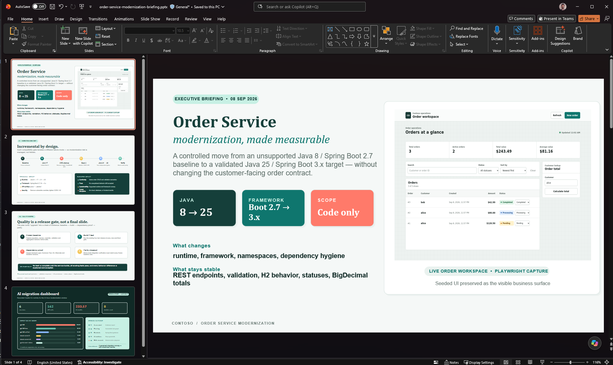