# Agentic Code Migration with GitHub Copilot

*Version 0.1 - July 2026*

The goal of this workshop is to learn how to use GitHub Copilot, .....

GitHub Copilot is an AI-powered code assistant that helps developers write better code faster. It uses machine learning models trained on billions of lines of code to suggest whole lines or entire functions based on the context of what you’re working on. By using GitHub Copilot, you can learn how to write better code and improve your productivity.

<div class="warning" data-title="warning">

> GitHub Copilot is a quickly evolving product and thus this workshop may not be 100% up to date with the different features of the various extensions you are going to use. Please be adaptable if it's not exactly the same.

</div>

## Minimal Pre-requisites

There are two ways to run this workshop:

- online with **GitHub Codespaces**: fastest and easiest way to start playing immediately with a hosted environment ready to go in seconds.

- locally on **your computer**: the best way to install and configure the tools you need to work with GitHub Copilot on every projects

These are the very minimal pre-requisites to run this workshop:

|                                 |                                                                                |
| ------------------------------- | ------------------------------------------------------------------------------ |
| A GitHub account                | [Create free GitHub account](https://github.com/join)                          |
| GitHub Copilot Access activated | Get Access to GitHub Copilot (section below)                                   |
| A web browser                   | [Download Microsoft Edge](https://www.microsoft.com/edge) or any other one ;-) |

## Get Access to GitHub Copilot

There are different ways to get access to GitHub Copilot:

- **As an individual**, you can sign up to use [Copilot Free](https://github.com/github-copilot/signup), without the need for a credit card. You are entitled to a limited number of completions and chat interactions per month with the free plan, which reset each month. Learn more about the [Copilot Free plan details and conditions](https://docs.github.com/en/copilot/about-github-copilot/subscription-plans-for-github-copilot).
- **As an individual**, sign up for a [paid subscription](https://github.com/github-copilot/signup/copilot_individual) to get unlimited completions and chat interactions. You can try GitHub Copilot for free with a one-time 30-day trial.

- **As a member of an organization or enterprise** that has a subscription to GitHub Copilot, you can request access to Copilot by going to [https://github.com/settings/copilot](https://github.com/settings/copilot) and requesting access under "Get Copilot from an organization."

<div class="warning" data-title="warning">

> The **Copilot Free** offer does not include the feature on the github.com platform like the Coding Agent and the Code Review agent that are part of this workshop. You can still run 90% of this workshop with a free subscription but for the rest you will need a paid license.

</div>

## Fork the repository

This workshop uses the following GitHub Repository: *** link to the repo ***

This repository is a code starter that will help you experiment all capabilities with GitHub Copilot. Take the time to look at the architecture design displayed.

Start by creating **your own fork** of the repository by clicking on the `Fork` button on the top right of the repository page. It will create a copy of the repository in your own GitHub account and you will be free to make any changes you want.

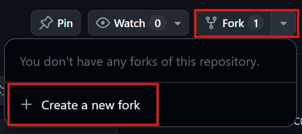

## OPTION 1: Work with GitHub Copilot CLI on Codespaces

The environment is already configured to work with [GitHub Codespaces](https://github.com/features/codespaces), you can find the configuration files in the *.devcontainer* folder.

To start programming just start a new codespace and you are ready to go, don't need to install anything.

<div class="info" data-title="note">

> Every individual users of GitHub has a free plan to run the codespace to let you try it with a free 120 core-hours per month [See Pricing](https://github.com/settings/billing/summary)

</div>

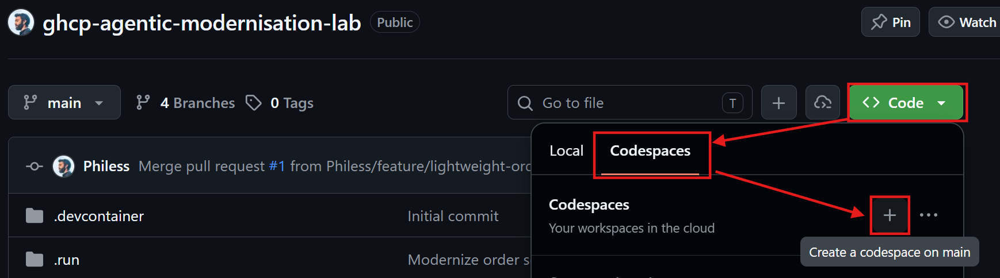

After just a few seconds, you will be redirected to your Codespace environment, a full developement environment ready to go in the browser.
**You can start coding right away**, your GitHub Copilot extensions are already installed and configured.

For an even better experience, and if you have VS Code installed on your local computer, you can open the Codespace in your local Visual Studio Code by clicking on the `Open in VS Code` button on the top left menu of your Codespace interface.


Once the Codespace created, you will be able to choose if you want to open codespace in the browser or in your local VS Code from the GitHub repository page directly.


## OPTION 2: Work locally with GitHub Copilot App or GitHub Copilot CLI

You can choose to work locally on your computer for this workshop and take that as an opportunity to install and configure the tools you'll need to work with GitHub Copilot on your projects.

You first need to install the following tools locally:

1. Install [Visual Studio Code](https://code.visualstudio.com/)
2. Install the [GitHub Copilot](https://marketplace.visualstudio.com/items?itemName=GitHub.copilot) extension
3. Install the [GitHub Copilot Chat](https://marketplace.visualstudio.com/items?itemName=GitHub.copilot-chat) extension
4. Install [Node and npm](https://docs.npmjs.com/downloading-and-installing-node-js-and-npm)
5. Install [.NET Core](https://dotnet.microsoft.com/download) \* *needed if you want to run provided .net code*
6. Clone your forked repository and open it in VS Code:

```bash
git clone https://github.com/<YourUser>/gh-copilot-demo
cd gh-copilot-demo
code .
```

Finally, you need login to your GitHub account in Visual Studio Code to activate the GitHub Copilot extensions. The extensions will ask you to login, but if you don't see the prompt, you can login by clicking on the user icon in the bottom left sidebar where you will see the logins for GitHub and GitHub Copilot Chat.


## How to run the code?

Everything is detailed in the bundled
[Order Service README](../app/Java%20-%20Spring%20Boot/Order%20Service/README.md).
From the workshop repository root, first change to the application directory:

```bash
cd "app/Java - Spring Boot/Order Service"
```

Take a look at it, and be sure to run at least the front-end app before going further, it will be mandatory to complete the tutorial.

## Help us improve this Workshop

If you face any challenge or bug running this workshop, please let us know. Your help will be invaluable in making this workshop better, specially as we try to maintain it on a regular basis to keep it up-to-date.

[Report any problem here.](https://github.com/Philess/GHCopilotHoL/issues/new)

---

# Level 1: Analyze the existing and build a plan

In this level, you will assess the
[Order Service application](../app/Java%20-%20Spring%20Boot/Order%20Service/README.md)
before changing any code. The goal is to establish a trustworthy baseline,
identify modernization risks and opportunities, define a target state, and
produce an actionable plan.

## Before you begin

You need:

- the workshop repository cloned and opened;
- a terminal positioned at the bundled Java project root,
  `app/Java - Spring Boot/Order Service`;
- the [GitHub Copilot app](https://github.com/github/app#install) or
  [GitHub Copilot CLI](https://github.com/github/copilot-cli), installed and
  signed in to your GitHub account;
- JDK 17 or later, Maven 3.6 or later, Node.js 18 or later, and Git; and
- Docker and the Azure CLI if you want the assessment to include container and
  Azure readiness.

Do not start upgrading dependencies or editing application code yet. Level 1
is complete when the findings and plan have been reviewed.

## Step 1: Discover Awesome Copilot and install the plugin

[Awesome Copilot](https://github.com/github/awesome-copilot) is a
community-created collection of customizations that extend GitHub Copilot. Open
the repository, then use the [Awesome Copilot catalog](https://awesome-copilot.github.com/)
to explore its contents.

Identify the purpose of each customization type before continuing:

| Customization | Purpose |
| --- | --- |
| Agents | Specialized Copilot personas and tool configurations for a particular role or workflow. |
| Instructions | Coding standards and project guidance applied automatically to matching files. |
| Skills | Reusable domain knowledge, procedures, and supporting resources that Copilot can load when relevant. |
| Plugins | Installable bundles of agents, skills, commands, hooks, or extensions for a complete workflow. |

Open **Plugins** in the catalog and search for
[github-copilot-modernization](https://awesome-copilot.github.com/plugin/github-copilot-modernization/).
This Microsoft-maintained plugin provides autonomous modernization for Java and
.NET applications through a hierarchy of orchestrator, coordinator, and
executor agents. Before installing it, open its [details](https://github.com/microsoft/github-copilot-modernization/tree/main/plugins/github-copilot-modernization)  and answer the following
questions:

1. Which modernization scenarios and application languages does it support?
2. Which agent can a user invoke directly?
3. Where does it write assessment and planning artifacts?
4. How can an enterprise rulebook constrain its recommendations?

You can install the plugin using either the GitHub Copilot app or the CLI.

**Option 1: Install from the GitHub Copilot app**

On the plugin details page, select **Open in GitHub Copilot app** and confirm the installation when prompted.
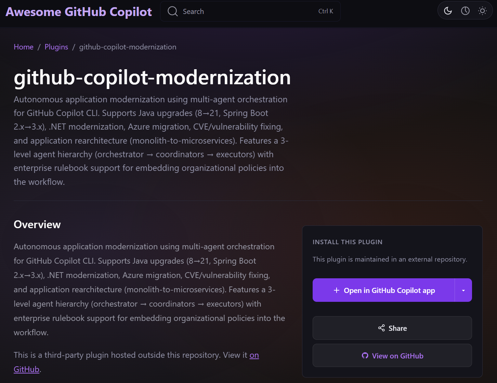
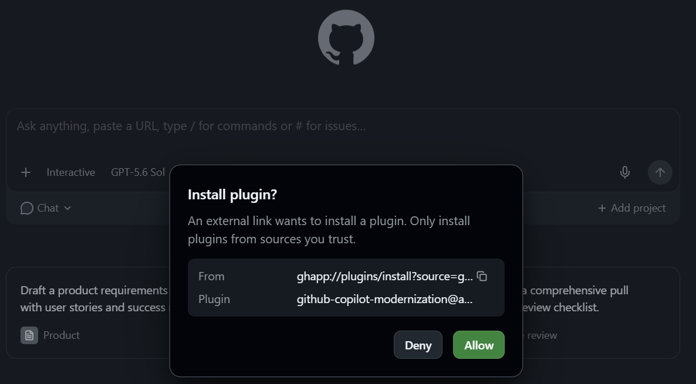

The plugin is installed under the **awesome-copilot** marketplace. Expand the
marketplace to view all available plugins and activate or deactivate them as
needed.


You can also view the installed plugin's skills by opening the **Skills** tab in the app, and filter by plugin.


**Option 2: Install with the CLI**

Follow the plugin repository's installation instructions:

```bash
/plugin marketplace add github/awesome-copilot
/plugin install github-copilot-modernization@awesome-copilot
```

Verify that the marketplace and plugin are available:

```bash
/plugin marketplace list
/plugin list
```

You can view installed plugin skills, MCP servers, and agent commands with:

```bash
/env
```

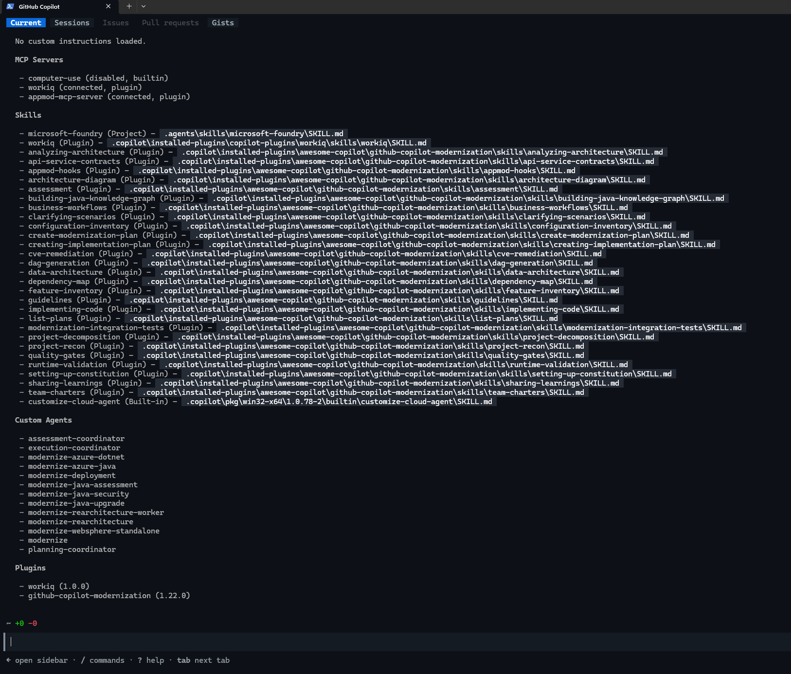

## Step 2: Establish the current baseline

Before asking GitHub Copilot to assess the project, confirm that the existing
application can be built and tested in its current state. From the Order
Service project directory, run:

```bash
cd "app/Java - Spring Boot/Order Service"
```

```bash
mvn clean test
mvn clean package
```

Record any failure instead of fixing it. A pre-existing failure is part of the
baseline and must not later be attributed to the modernization.

Start the backend in a terminal:

```bash
mvn spring-boot:run
```

Confirm that the seeded Order API responds at
`http://localhost:8080/api/orders`:

```bash
curl http://localhost:8080/api/orders
```

In a second terminal, install and start the frontend:

```bash
cd frontend
npm install
npm run dev
```

Open `http://localhost:5173` and confirm that the UI can retrieve orders from
the backend. Record the test results, API response, and any startup warnings as
part of the baseline.

Inspect the repository and capture:

- modules and their responsibilities;
- current Java version, build tool, and Spring Boot versions;

## Step 3: Check modernization readiness

The plugin discovers Java projects from a `pom.xml` file. From
the Order Service project directory, confirm that the build file is present and
check the required tools:

```bash
java -version
mvn -version
node --version
npm --version
git --version
```

Resolve only missing tooling that prevents assessment. Record optional tooling
that will be needed in later levels.

## Step 4: Run the assessment

In Github Copilot app, start a new Session in your forked lab repository
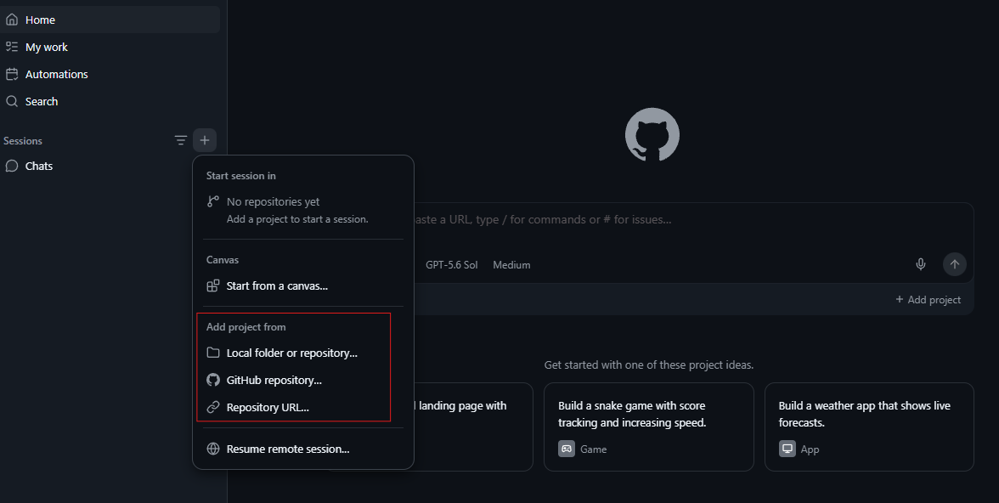
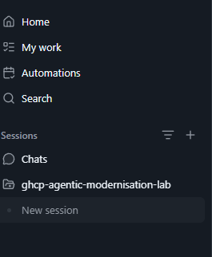

In the Session, select the `modernize-java-assessment` agent.
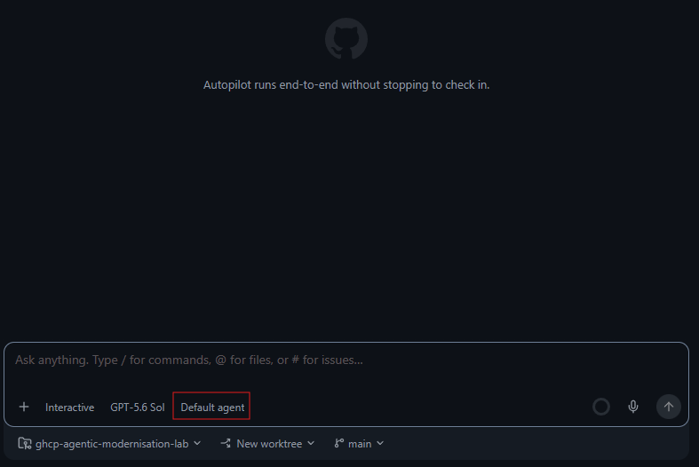
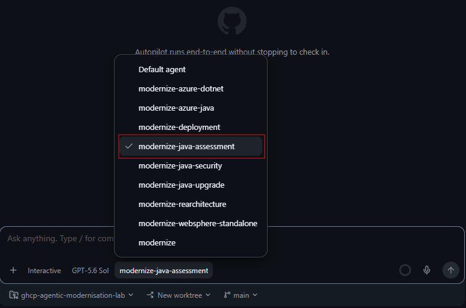

Send the following prompt to the agent:
```text
Assess this Java application Order Service for migration to Java 25, upgrading Spring Boot, and remediating security vulnerabilities.
```
GitHub Copilot creates a Git worktree for the session. 
A worktree is an additional checkout linked to the same Git repository: it shares the
repository's history and objects while maintaining its own working directory,
index, and checked-out branch. This gives Copilot an isolated workspace in
which to analyze the application without changing the files in your main
working directory, and it allows multiple agent sessions to work in parallel.

The assessment agent delegates the detailed analysis to a specialized subagent,
which starts as a background task. The **Background** indicator shows that the
subagent is still running and can be opened to monitor its progress. Wait for
the background task to finish and return its evidence-based findings before
reviewing the generated assessment report.

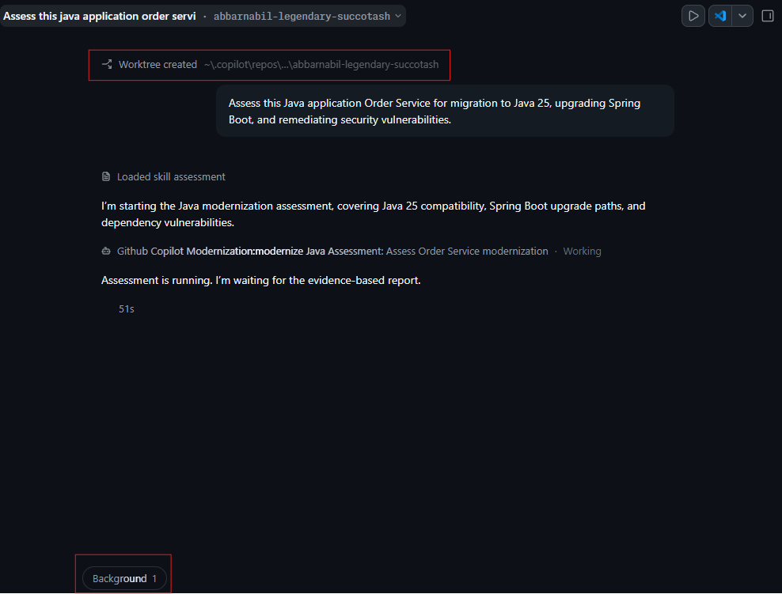

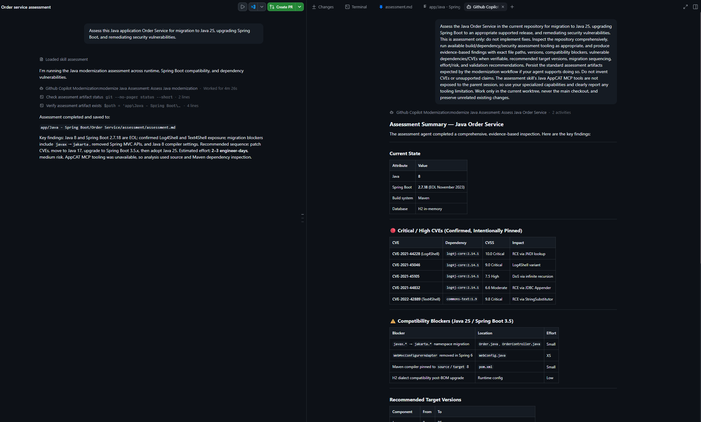

After the assessment is complete, the agent generates a report in Markdown that includes a summary of the findings and recommendations.

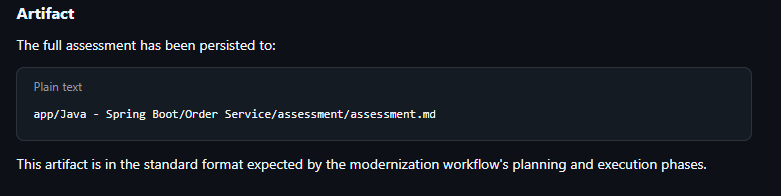

The assessment report describes the current state of the application, including its dependencies, vulnerabilities, and modernization opportunities.

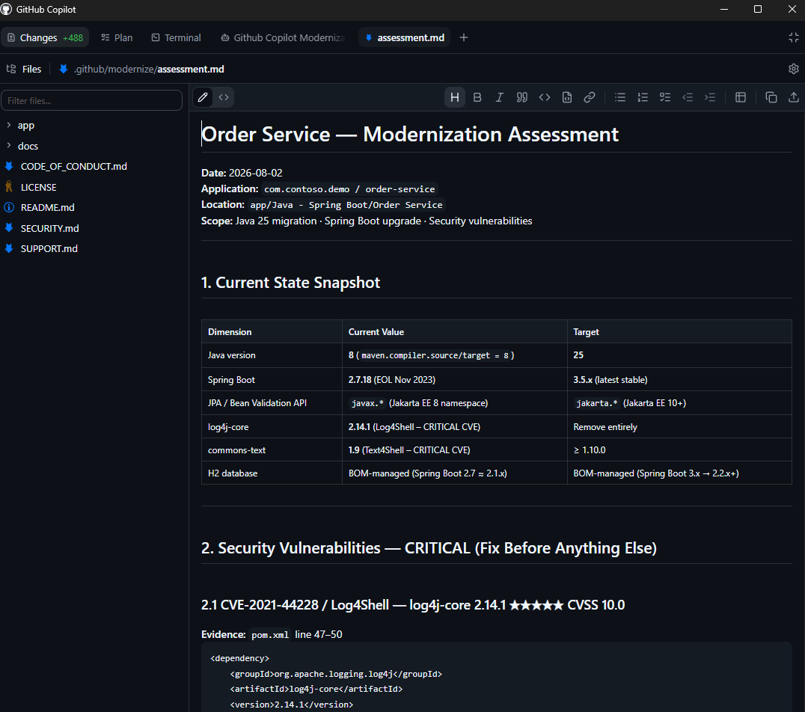
> The opening inventory compares the current Java 8 and Spring Boot 2.7 stack with the Java 25 and Spring Boot 3.5 targets. It also surfaces end-of-life components and vulnerable dependencies that require attention.

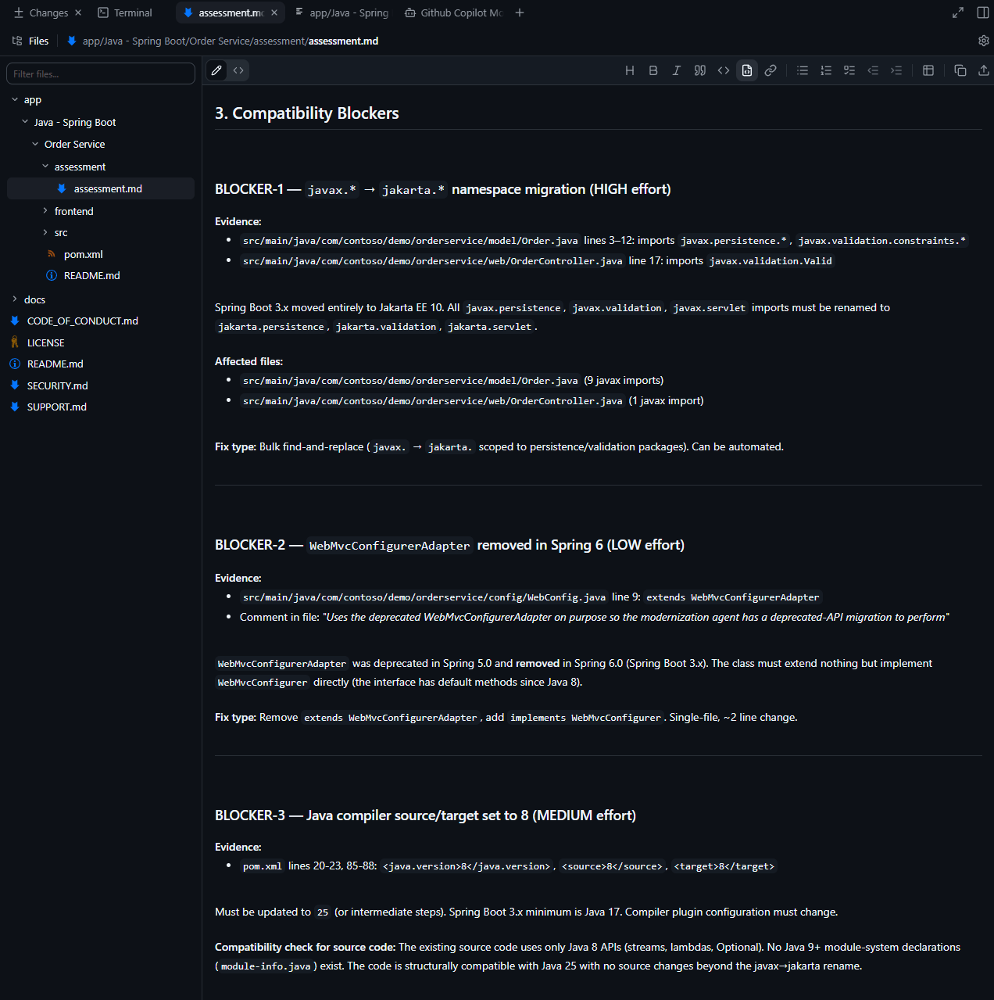
> The compatibility analysis identifies the concrete changes required for the upgrade.

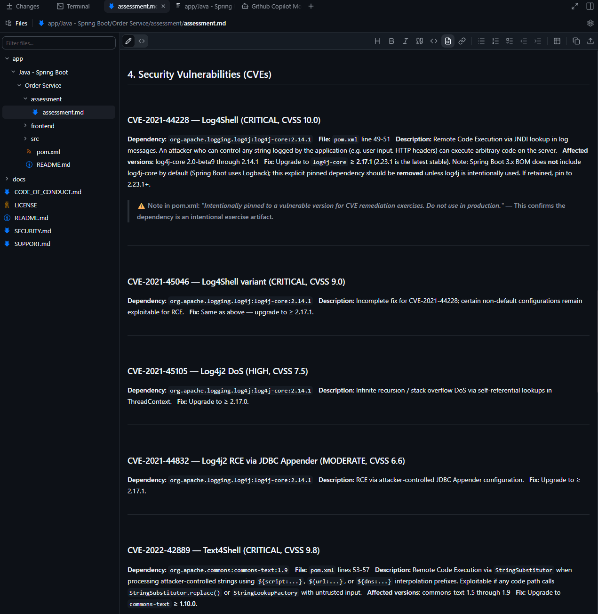
> The security findings trace each CVE to a specific dependency and version, explain its impact, and provide a minimum safe upgrade target.

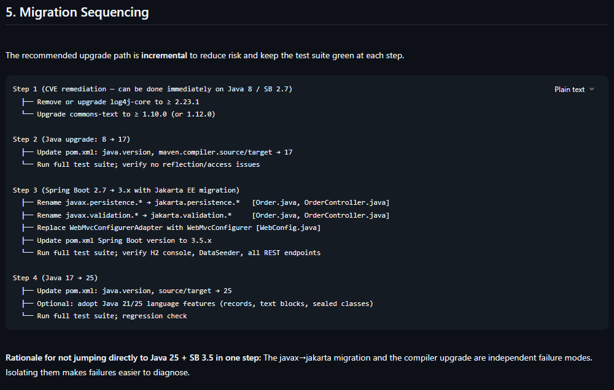
> The recommended sequence isolates risk into testable stages: remediate CVEs first, move to Java 17, complete the Spring Boot and Jakarta migration, and then advance to Java 25. Running the full test suite after each stage makes failures easier to identify and resolve.


## Step 5: Validate and refine the findings

Compare each material finding in the assessment with the baseline evidence.
Correct unsupported assumptions, add missed dependencies and constraints, and
record which recommendations you accept, reject, or defer before planning.

## Step 6: Build the modernization plan

Now that the assessment is complete and validated, you can generate a modernization plan. The plan organizes the recommended tasks into a prioritized sequence of executable steps, including validation criteria for each task.

### Why start a new session?

The first session has completed its assessment role and externalized the information needed for planning into a repository artifact:

- `./assessment/assessment.md` contains the validated findings, supporting evidence, risks, and recommendations;

This file provides a durable handoff between the assessment and planning phases, so the planning agent does not need the assessment conversation itself. That conversation may contain source-code scans, command output, subagent messages, intermediate conclusions, and repeated findings. Continuing in the same session makes that history compete with the plan for space in the model's context window and can cause Copilot to process more tokens on every turn.

Starting a new session gives the planner a clean context. Copilot only needs to load the final assessment artifacts, the planning prompt, and any relevant project files. This reduces unnecessary token usage, leaves more context capacity for producing a detailed plan, and prevents superseded assessment discussions from distracting the planner from the validated findings.

> **Important:** Before requesting the handoff, make sure `assessment.md` is saved and available on the branch or worktree that the new session will use. The files carry the work forward; the previous chat history does not.

You do not need to create the session or change its mode manually. From the completed assessment session, copy and send the following prompt:
```text
Start a new session for this repository in Plan mode. In that new session, use @./assessment/assessment.md as the source of truth to create a prioritized, executable modernization plan for the Order Service. Preserve the validated target state and accepted recommendations recorded in this artifact. Include dependencies, risk, scope, and validation criteria for every task. Keep this assessment session unchanged and perform all planning in the new session.
```
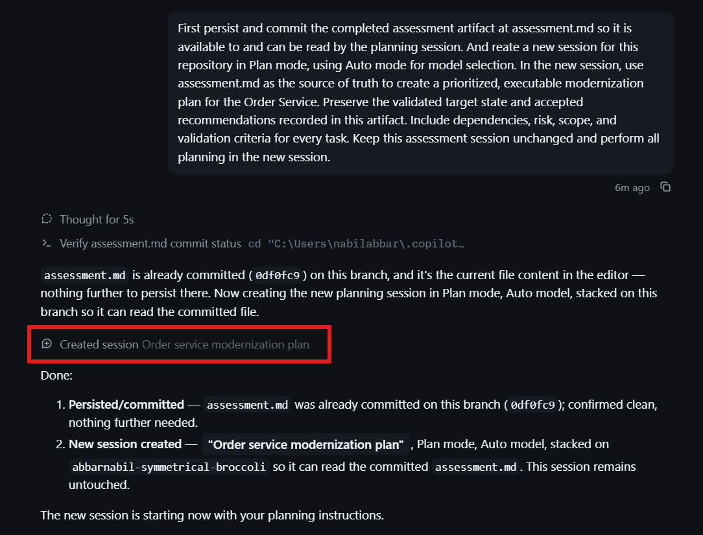

> Copilot confirms that it created a separate planning session grounded in the assessment artifact. The assessment session remains unchanged and only coordinates the handoff.

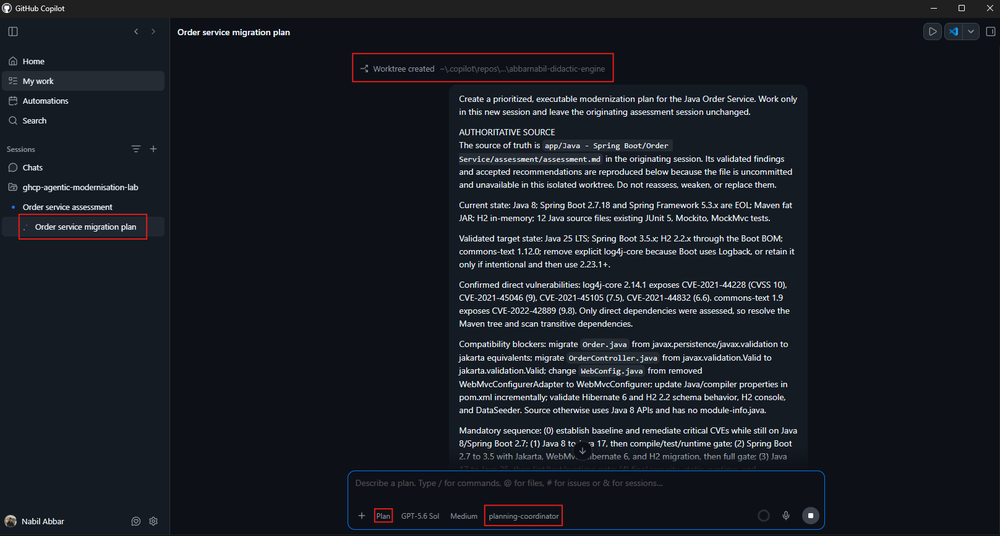

> The new session appears separately in the repository session list. It runs in **Plan** mode with the planning coordinator agent, loads the modernization-planning skill from the plugin, and references `assessment.md` in the kickoff prompt.

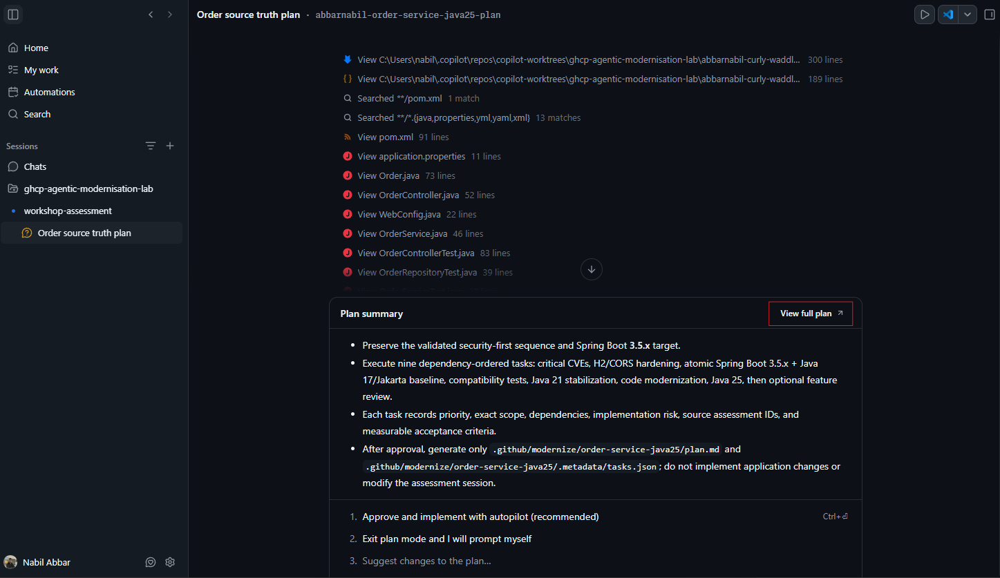

> Copilot first presents a concise plan summary for review. It preserves the validated security-first sequence, orders the migration tasks by dependency, identifies the files it will generate, and waits for approval.

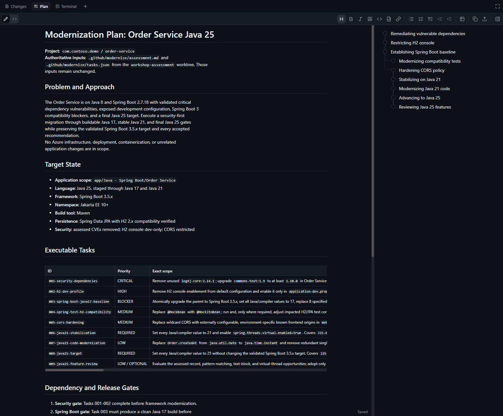

> Select **View full plan** to inspect the complete proposal. Verify the problem statement, target Java and Spring Boot versions, task priorities, exact scope, and task ordering against the validated assessment.

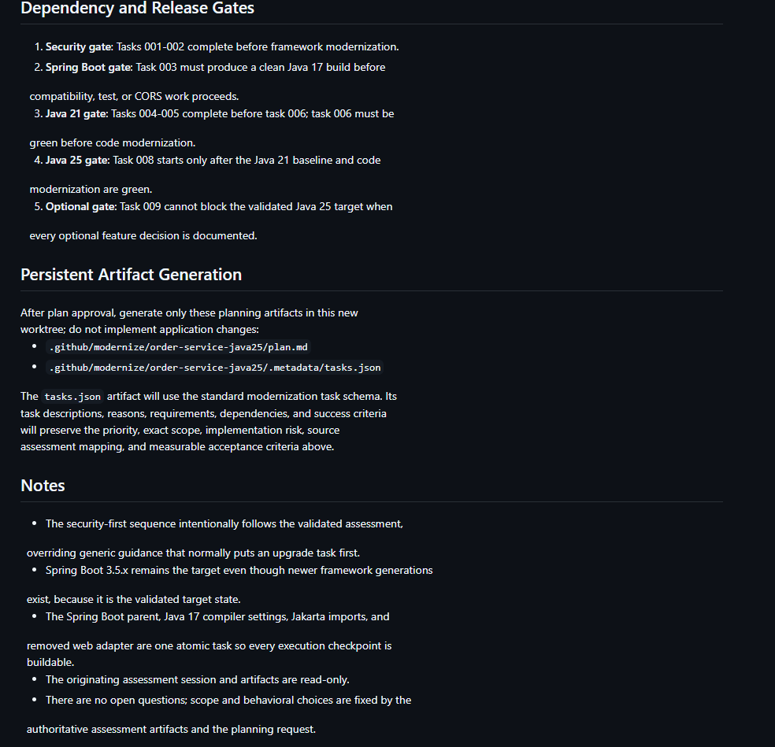

> The final sections define release gates between the security, Spring Boot, Java 21, and Java 25 stages. They also identify the persistent `plan.md` and `tasks.json` outputs and confirm that the assessment artifacts remain read-only.

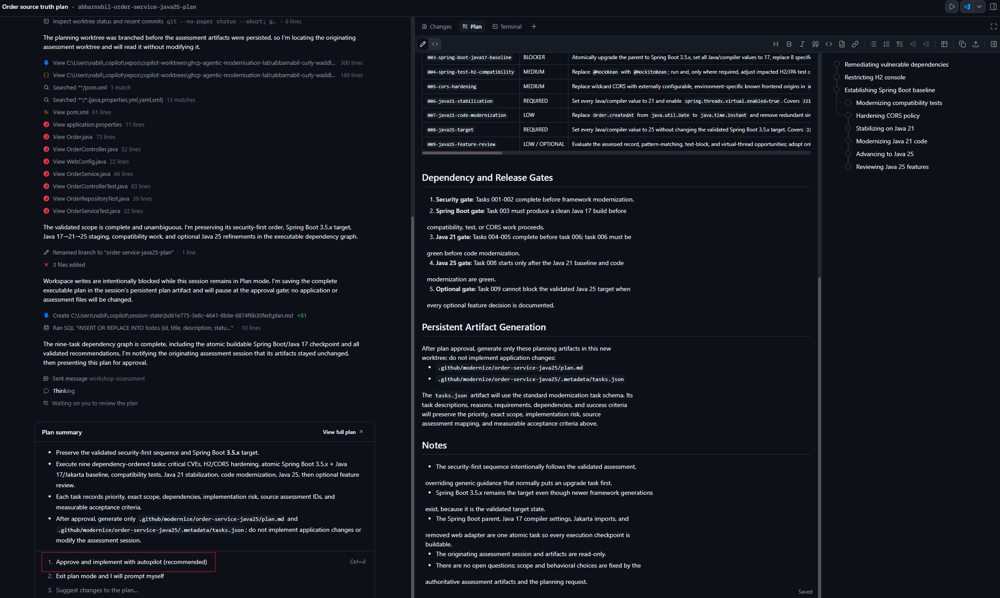

> The completed plan pauses at an explicit approval gate. Review the full plan before selecting **Approve and implement with autopilot**; alternatively, exit Plan mode to continue manually or request changes when the scope, sequencing, or validation criteria need refinement.

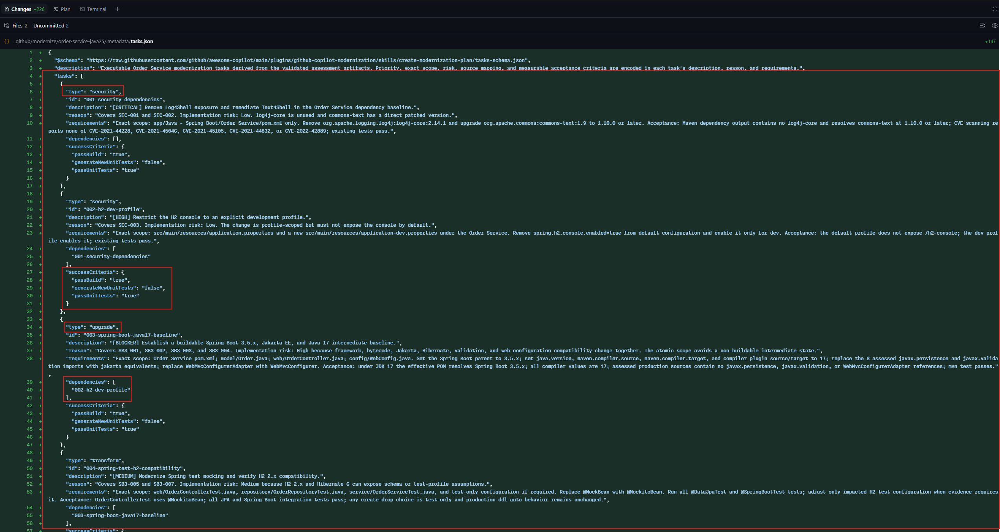

> After approval, Copilot persists the executable task graph in `tasks.json`. Each task records its type, exact requirements, dependencies, and measurable success criteria, enabling the implementation agents to execute work in the intended order and verify every result.

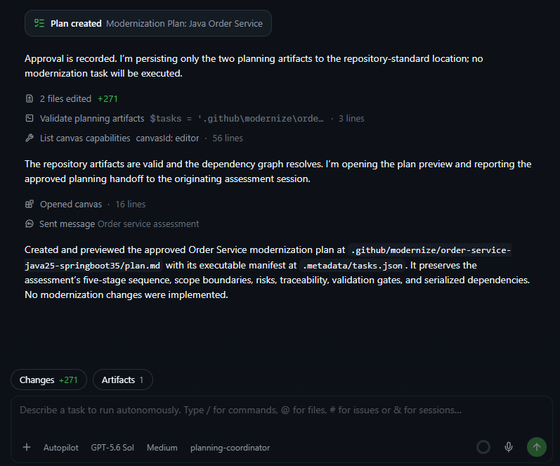

> After approval, Copilot validates and saves the two planning artifacts, `plan.md` and `tasks.json`, in the repository's `.github/modernize/` directory. No modernization tasks are executed at this stage.

---

# Level 2: Setup the guardrails

[Philippe]

Marketplace, plugins, agents, skills & instructions, MCP

Update plan

---

# Level 3: Implementation

[Philippe => CLI & Nabil => App]

Multi-agent worflow 
=> choose the right model
=> Autopilot

In this level, you will execute the approved modernization plan with GitHub Copilot. You can use either the GitHub Copilot app or GitHub Copilot CLI. Both options invoke the same `modernize` orchestrator and use the plan artifacts created in Level 1 and refined with the guardrails from Level 2.

The implementation is intentionally performed in a separate session. The execution agents need the final `plan.md`, `tasks.json`, rulebook, and project files, but they do not need the assessment and planning conversations.

## Before you begin

Confirm that:

- the final `plan.md` and `tasks.json` are present under
  `.github/modernize/<plan-name>/`;
- the plan reflects the guardrails added in Level 2;
- the approved artifacts are available in the branch or worktree used by the
  new execution session;
- the baseline tests from Level 1 pass, or any pre-existing failures have been
  recorded; and
- the target JDK and Maven versions required by the approved plan are
  available.

Do not run two implementation sessions against the same worktree at the same
time. The executor creates a dedicated `modernize/java-<timestamp>` branch and
all worker agents contribute to that branch.

## Understand the multi-agent workflow

Only the `modernize` agent is user-invocable. Do not select an execution
coordinator or worker directly. The orchestrator loads the existing plan and
delegates its tasks through the following hierarchy:

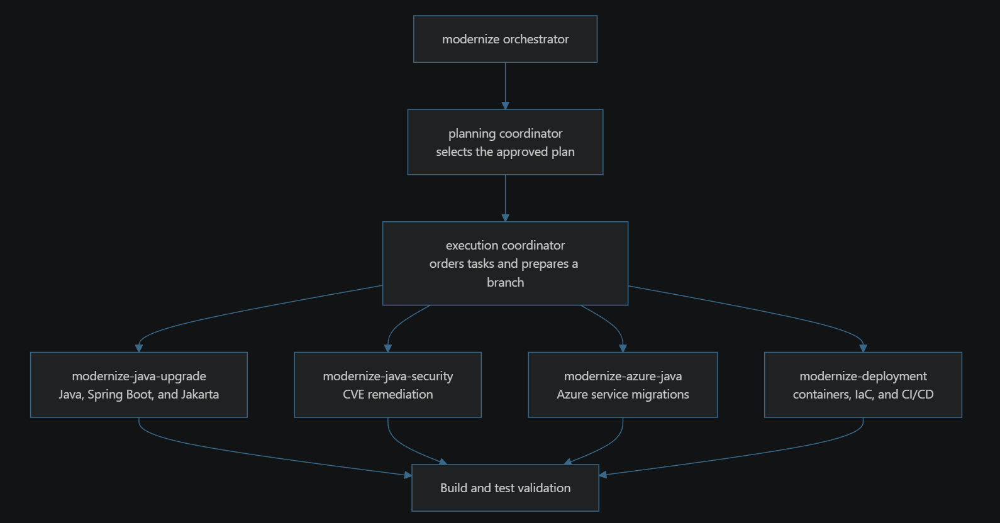

The execution coordinator groups related Java and Spring Boot upgrades into a single delegation, sends security and migration work to their specialized agents, runs independent work in parallel when possible, and waits for task dependencies before continuing. Each worker is responsible for its code changes, commits, and validation.

## Step 1: Choose the execution model

Model choice affects reasoning quality, tool use, speed, and AI credits consumption. The plugin's agents declare their own [preferred models](https://github.com/microsoft/github-copilot-modernization/blob/8b644bebc7e1f929c01d80788293a37872f480f8/plugins/github-copilot-modernization/agents/execution-coordinator.agent.md?plain=1#L4).

If the configured model is unavailable in your organization, choose an available model optimized for complex coding and agentic tool use.

Record the selected model so you can compare execution time, tool calls, and results with another model after the workshop.

## Step 2: Start the implementation

Remain in the completed planning session after approving the plan. From that same session, send the following handoff prompt:

```text
Start a new session with the modernize agent in Autopilot mode using Claude sonnet 4.6. In that new session, execute the approved modernization plan for the Order Service from @plan.md. Use @tasks.json as the source of truth, enforce the rulebook, and respect every dependency and validation gate.
```
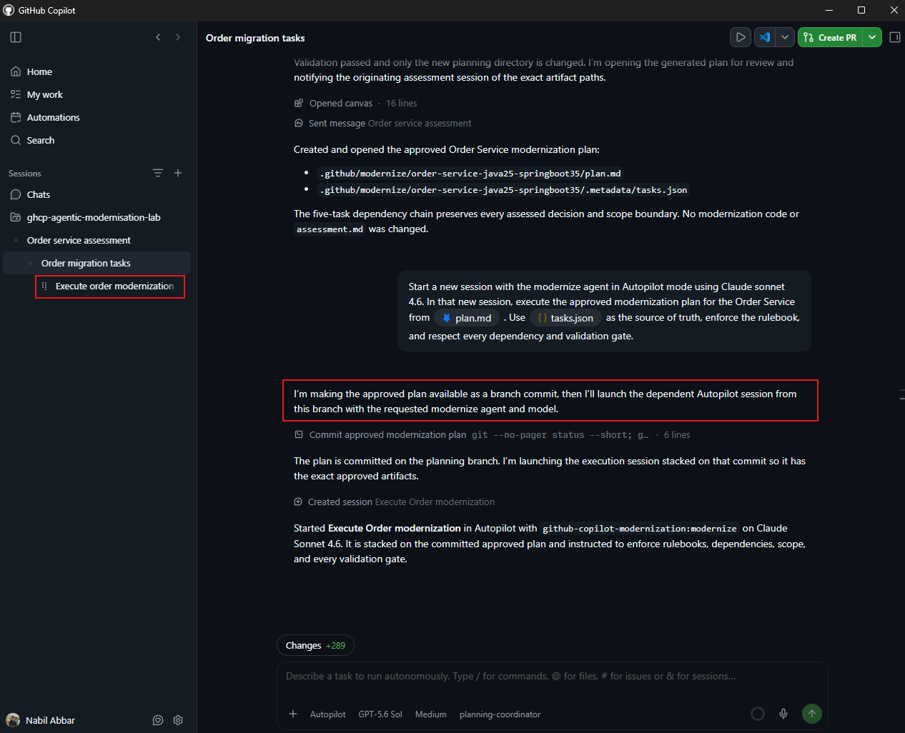

Copilot creates a separate implementation session and worktree while leaving the approved planning session unchanged. Open the new session from the repository session list, then verify that it uses the `modernize` agent, runs in **Autopilot** mode, and references the approved `plan.md` and `tasks.json` before implementation begins.

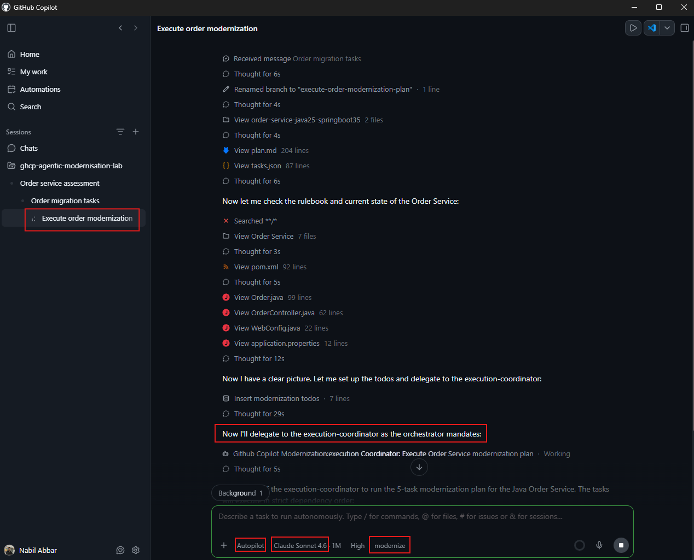

The session delegates implementation tasks to background subagents. Open the **Background** view to inspect which specialized agent owns each task and to follow its progress. Let the orchestration finish before editing files in the execution worktree.

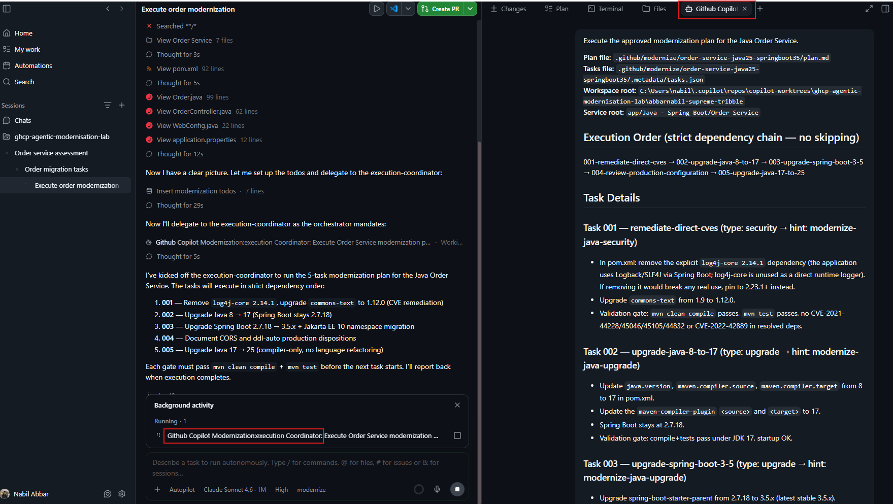
## Step 3: Observe the orchestration

While execution is running, identify and record:

1. the branch created for the implementation;
2. the task groups sent to each specialized worker;
3. the build or test command used at each release gate; and
4. any retry, blocked task, or deviation from the approved plan.

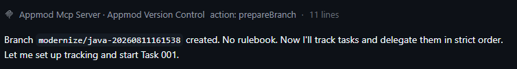

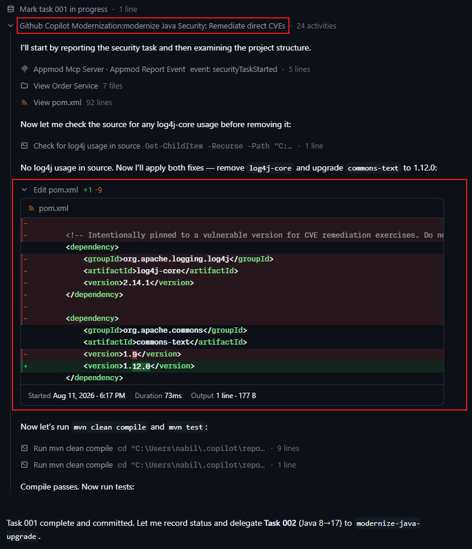

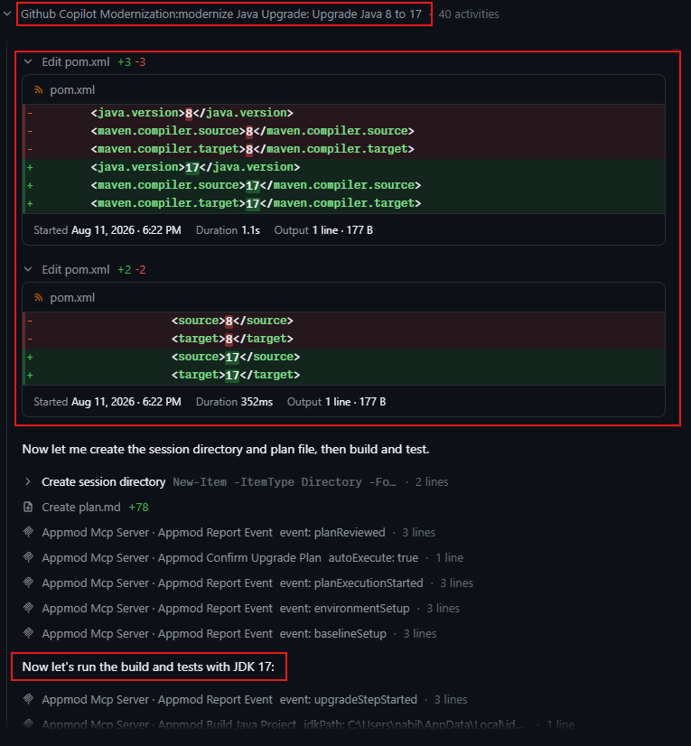

Autopilot removes repetitive approval prompts; it does not remove quality gates. A task is successful only when its required build, tests, and acceptance criteria pass. If a worker reports a failure, preserve its diagnostics and do not approve the remaining dependent tasks as complete. Ask the orchestrator to retry only after you have reviewed the cause.

## Step 4: Review the execution result

When all workers return, inspect the final execution summary. It should state:

- completed and failed tasks;
- files and dependencies changed;
- commits created on the modernization branch;
- build and test results; and
- any manual follow-up work.

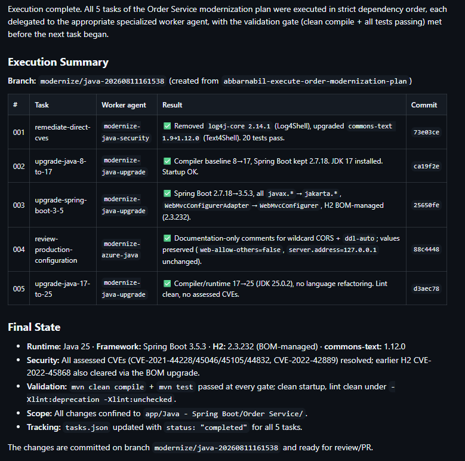

Review the branch history and working tree before running your own checks

## Step 5: Verify independently

Agent-reported validation is useful evidence, but it does not replace your own
acceptance check. From the Order Service directory, run:

```bash
mvn clean test
mvn clean package
```

Confirm the effective runtime and build JDK match the approved target:

```bash
java -version
mvn -version
```

Start the modernized backend:

```bash
mvn spring-boot:run
```

In another terminal, verify that the existing API contract still works:

```bash
curl http://localhost:8080/api/orders
```

Finally, start the frontend and confirm that its order list and create-order
workflow still work against the modernized API:

```bash
cd frontend
npm install
npm run dev
```

Compare these results with the Level 1 baseline. Record any behavior change,
warning, failed test, or plan deviation before moving to the quality and
security review in Level 4.

---

# Level 4: Quality & Security

[Nabil]
Customize Code review
Validate code quality, security
Fix vulnerabilities

--- 

# Level 5: Bonus

[Philippe]
Generer une présentation PPT