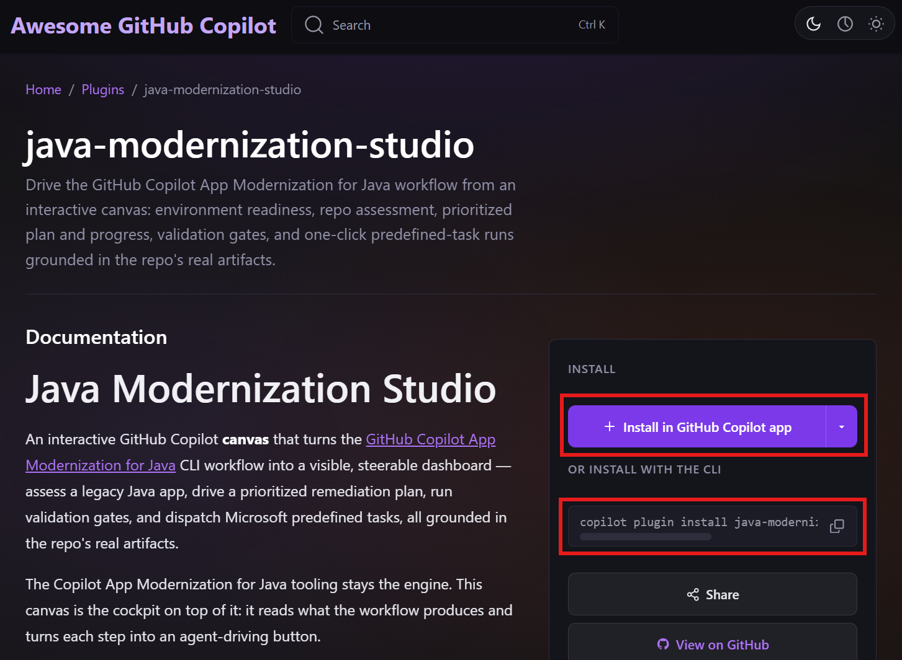
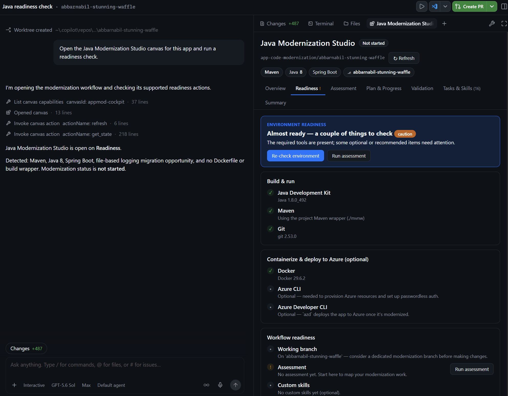
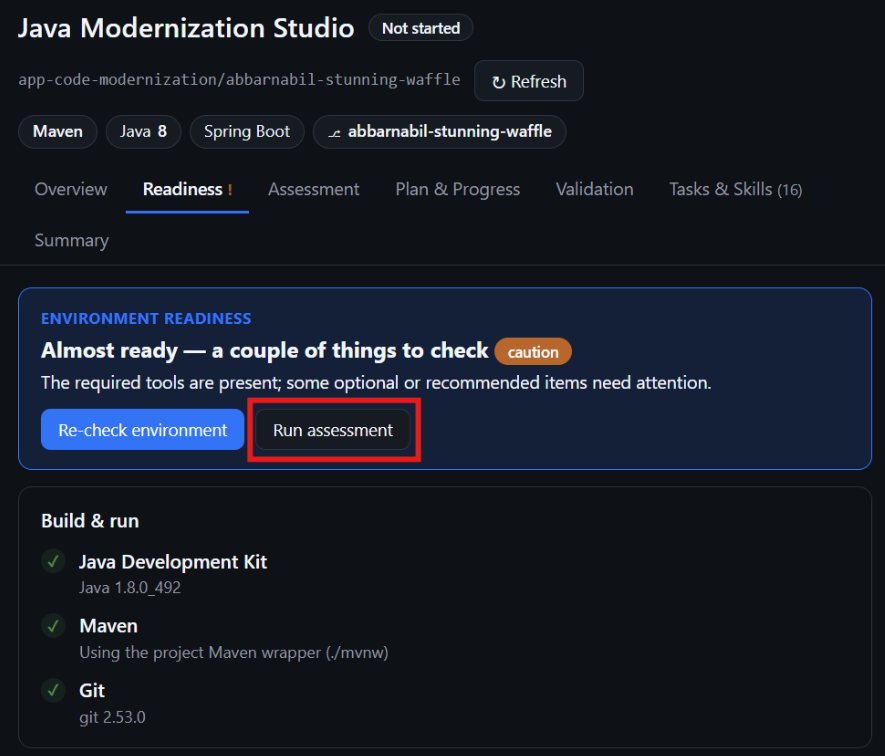

# Agentic Code Migration with GitHub Copilot

*Version 0.1 - July 2026*

The goal of this workshop is to learn how to use GitHub Copilot, .....

GitHub Copilot is an AI-powered code assistant that helps developers write better code faster. It uses machine learning models trained on billions of lines of code to suggest whole lines or entire functions based on the context of what you’re working on. By using GitHub Copilot, you can learn how to write better code and improve your productivity.

<div class="warning" data-title="warning">

> GitHub Copilot is a quickly evolving product and thus this workshop may not be 100% up to date with the different features of the various extensions you are going to use. Please be adaptable if it's not exactly the same.

</div>

## Minimal Pre-requisites

There are two ways to run this workshop:

- online with **GitHub Codespaces**: fastest and easiest way to start playing immediately with a hosted environment ready to go in seconds.

- locally on **your computer**: the best way to install and configure the tools you need to work with GitHub Copilot on every projects

These are the very minimal pre-requisites to run this workshop:

|                                 |                                                                                |
| ------------------------------- | ------------------------------------------------------------------------------ |
| A GitHub account                | [Create free GitHub account](https://github.com/join)                          |
| GitHub Copilot Access activated | Get Access to GitHub Copilot (section below)                                   |
| A web browser                   | [Download Microsoft Edge](https://www.microsoft.com/edge) or any other one ;-) |

## Get Access to GitHub Copilot

There are different ways to get access to GitHub Copilot:

- **As an individual**, you can sign up to use [Copilot Free](https://github.com/github-copilot/signup), without the need for a credit card. You are entitled to a limited number of completions and chat interactions per month with the free plan, which reset each month. Learn more about the [Copilot Free plan details and conditions](https://docs.github.com/en/copilot/about-github-copilot/subscription-plans-for-github-copilot).
- **As an individual**, sign up for a [paid subscription](https://github.com/github-copilot/signup/copilot_individual) to get unlimited completions and chat interactions. You can try GitHub Copilot for free with a one-time 30-day trial.

- **As a member of an organization or enterprise** that has a subscription to GitHub Copilot, you can request access to Copilot by going to [https://github.com/settings/copilot](https://github.com/settings/copilot) and requesting access under "Get Copilot from an organization."

<div class="warning" data-title="warning">

> The **Copilot Free** offer does not include the feature on the github.com platform like the Coding Agent and the Code Review agent that are part of this workshop. You can still run 90% of this workshop with a free subscription but for the rest you will need a paid license.

</div>

## Fork the repository

This workshop uses the following GitHub Repository: *** link to the repo ***

This repository is a code starter that will help you experiment all capabilities with GitHub Copilot. Take the time to look at the architecture design displayed.

Start by creating **your own fork** of the repository by clicking on the `Fork` button on the top right of the repository page. It will create a copy of the repository in your own GitHub account and you will be free to make any changes you want.


## OPTION 1: Work with GitHub Copilot CLI on Codespaces

The environment is already configured to work with [GitHub Codespaces](https://github.com/features/codespaces), you can find the configuration files in the *.devcontainer* folder.

To start programming just start a new codespace and you are ready to go, don't need to install anything.

<div class="info" data-title="note">

> Every individual users of GitHub has a free plan to run the codespace to let you try it with a free 120 core-hours per month [See Pricing](https://github.com/settings/billing/summary)

</div>


After just a few seconds, you will be redirected to your Codespace environment, a full developement environment ready to go in the browser.
**You can start coding right away**, your GitHub Copilot extensions are already installed and configured.

For an even better experience, and if you have VS Code installed on your local computer, you can open the Codespace in your local Visual Studio Code by clicking on the `Open in VS Code` button on the top left menu of your Codespace interface.


Once the Codespace created, you will be able to choose if you want to open codespace in the browser or in your local VS Code from the GitHub repository page directly.


## OPTION 2: Work locally with GitHub Copilot App or GitHub Copilot CLI

You can choose to work locally on your computer for this workshop and take that as an opportunity to install and configure the tools you'll need to work with GitHub Copilot on your projects.

You first need to install the following tools locally:

1. Install [Visual Studio Code](https://code.visualstudio.com/)
2. Install the [GitHub Copilot](https://marketplace.visualstudio.com/items?itemName=GitHub.copilot) extension
3. Install the [GitHub Copilot Chat](https://marketplace.visualstudio.com/items?itemName=GitHub.copilot-chat) extension
4. Install [Node and npm](https://docs.npmjs.com/downloading-and-installing-node-js-and-npm)
5. Install [.NET Core](https://dotnet.microsoft.com/download) \* *needed if you want to run provided .net code*
6. Clone your forked repository and open it in VS Code:

```bash
git clone https://github.com/<YourUser>/gh-copilot-demo
cd gh-copilot-demo
code .
```

Finally, you need login to your GitHub account in Visual Studio Code to activate the GitHub Copilot extensions. The extensions will ask you to login, but if you don't see the prompt, you can login by clicking on the user icon in the bottom left sidebar where you will see the logins for GitHub and GitHub Copilot Chat.


## How to run the code?

Everything is detailed on the **README.MD** file in the root folder of the code repository.

Take a look at it, and be sure to run at least the front-end app before going further, it will be mandatory to complete the tutorial.

## Help us improve this Workshop

If you face any challenge or bug running this workshop, please let us know. Your help will be invaluable in making this workshop better, specially as we try to maintain it on a regular basis to keep it up-to-date.

[Report any problem here.](https://github.com/Philess/GHCopilotHoL/issues/new)

---

# Level 1: Analyse the existing and build a plan

In this level, you will assess the
[Order Service application](https://github.com/ABBARNABIL/app-code-modernization)
before changing any code. The goal is to establish a trustworthy baseline,
identify modernization risks and opportunities, define a target state, and
produce an actionable plan.

## Learning objectives

By the end of this level, you will be able to:

- describe the application's current architecture, dependencies, integrations,
  and operational constraints;
- discover reusable GitHub Copilot customizations in the Awesome Copilot
  catalog and install a plugin;
- use GitHub Copilot and Java Modernization Studio to assess modernization
  readiness;
- validate AI-generated findings against evidence in the repository;
- prioritize findings by impact, risk, dependency, and effort; and
- create a modernization plan with measurable validation criteria.

## Before you begin

You need:

- the application repository opened at the Java project root;
- the GitHub Copilot app, signed in to your GitHub account;
- [GitHub Copilot App Modernization for Java](https://learn.microsoft.com/azure/developer/java/migration/migrate-github-copilot-app-modernization-for-java),
  which provides the underlying modernization workflow;
- JDK 17 or later, Maven 3.6 or later, Node.js 18 or later, and Git; and
- Docker and the Azure CLI if you want the assessment to include container and
  Azure readiness.

Do not start upgrading dependencies or editing application code yet. Level 1
is complete when the findings and plan have been reviewed, not when the
migration has been implemented.

## Step 1: Discover Awesome Copilot and install the plugin

[Awesome Copilot](https://github.com/github/awesome-copilot) is a
community-created collection of customizations that extend GitHub Copilot. Open
the repository, then use the [Awesome Copilot catalog](https://awesome-copilot.github.com/)
to explore its contents.

Identify the purpose of each customization type before continuing:

| Customization | Purpose |
| --- | --- |
| Agents | Specialized Copilot personas and tool configurations for a particular role or workflow. |
| Instructions | Coding standards and project guidance applied automatically to matching files. |
| Skills | Reusable domain knowledge, procedures, and supporting resources that Copilot can load when relevant. |
| Plugins | Installable bundles of agents, skills, commands, hooks, or extensions for a complete workflow. |

Open **Plugins** in the catalog and search for **Java Modernization Studio**.
Before installing it, open its details and answer the following questions:

1. What problem does the plugin solve?
2. Which underlying modernization tooling does it drive?
3. Which repository artifacts does it read and generate?
4. Which commands or tools can it run?

You can install the plugin using either the GitHub Copilot app or the CLI.

**Option 1: Install from the GitHub Copilot app**

On the **Java Modernization Studio** details page, click **Install** and confirm
the installation if prompted.



**Option 2: Install with the CLI**

In the terminal provided by the GitHub Copilot app, run:

```bash
copilot plugin install java-modernization-studio@awesome-copilot
```

For most current installations, the marketplace is registered automatically.
If Github Copilot reports that `awesome-copilot` is unknown, register it once and retry:

```bash
copilot plugin marketplace add github/awesome-copilot
copilot plugin install java-modernization-studio@awesome-copilot
```

Reload or restart the GitHub Copilot app if requested. Verify the installation
by asking Github Copilot to open the plugin without starting an assessment yet:

```text
Open the Java Modernization Studio canvas for this repository.
```

You should see the **Overview**, **Readiness**, **Assessment**, **Plan &
Progress**, **Validation**, and **Tasks** views.

## Step 2: Establish the current baseline

Before asking Github Copilot to assess the project, confirm that the existing
application can be built and tested in its current state. From the repository
root, run:

```bash
mvn clean test
mvn clean package
```

Record any failure instead of fixing it. A pre-existing failure is part of the
baseline and must not later be attributed to the modernization.

Start the backend in a terminal:

```bash
mvn spring-boot:run
```

Confirm that the seeded Order API responds at
`http://localhost:8080/api/orders`:

```bash
curl http://localhost:8080/api/orders
```

In a second terminal, install and start the frontend:

```bash
cd frontend
npm install
npm run dev
```

Open `http://localhost:5173` and confirm that the UI can retrieve orders from
the backend. Record the test results, API response, and any startup warnings as
part of the baseline.

Inspect the repository and capture:

- modules and their responsibilities;
- current Java, build tool, Spring, and Spring Boot versions;
- external services such as databases, message brokers, object storage, and
  identity providers;
- configuration and secret-management patterns;
- test types, coverage, build status, and deployment assets; and
- known security, supportability, performance, and observability concerns.

Create a simple current-state architecture diagram showing application modules,
data stores, external services, protocols, and trust boundaries. This diagram
will be compared with the proposed target architecture later.

## Step 3: Check modernization readiness

Open the Java Modernization Studio canvas for the project and run its
Environment Doctor:

```text
Open the Java Modernization Studio canvas for this repository and run a readiness check.
```

Review the result for JDK, Maven, Git, Docker, and Azure CLI. Resolve
only missing tooling that prevents the assessment from running. Document
optional tooling that will be needed in later levels.



## Step 4: Run the assessment

From the canvas, start **Assessment** and ask the agent to generate the
assessment and planning artifacts:



```text
Assess this Java application for modernization. Ground every finding in repository
evidence. Generate .appmod/assessment.json and prioritized plan.md and progress.md
files, but do not modify application code or execute the plan.
```
## Step 5: Validate and refine the findings


## Step 6: Define the target state

Agree on the modernization outcomes before selecting implementation tasks.
Document:

- target Java and framework versions, with support-lifecycle justification;
- target hosting model and deployment platform;
- target services for data, messaging, storage, identity, and secrets;
- measurable success criteria

## Step 7: Build the modernization plan

Use the validated findings and target state to refine `plan.md`.
---

# Level 2: Setup the guardrails

[Philippe]

Marketplace, plugins, agents, skills & instructions, MCP

Update plan

---

# Level 3: Implementation

[Philippe => CLI & Nabil => App]

Multi-agent worflow 
=> choose the right model
=> Autopilot

---

# Level 4: Quality & Security

[Nabil]
Customize Code review
Validate code quality, security
Fix vulnerabilities

--- 

# Level 5: Bonus

[Philippe]
Generer une présentation PPT